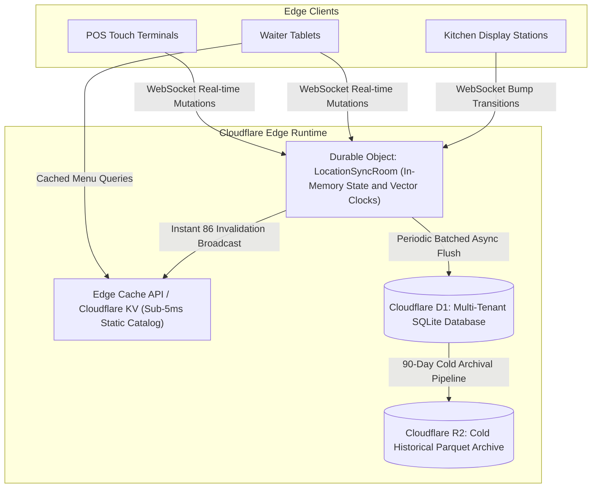

# Cloudflare D1 Multi-Tenant Schema & Scalability Architecture

## Overview & System Objectives

**PlinthOS** uses Cloudflare D1 (distributed SQLite at the edge) as its persistent cloud relational source of truth, analytical ledger, and multi-tenant catalog store. This document establishes the architectural invariants and scalability strategies designed to support dozens of restaurant client brands with hundreds of concurrent active users (cashiers, captains, waiters, kitchen display stations, and back-office managers).

---

## 1. Hybrid Write Absorption Model (Durable Objects + D1)

### The Constraint
Cloudflare D1 processes writes through a single primary coordinator before replicating to read replicas. Under high concurrent write spikes (e.g., hundreds of POS checkouts, modifier selections, and KDS station bumps occurring simultaneously across busy lunch/dinner services), direct unbuffered transactional writes to a single shared D1 database would risk write-lock queuing bottlenecks.

### The Solution: Hybrid Write Architecture


1. **Stateful In-Memory Absorption**:
   - Each restaurant outlet connects to a dedicated Cloudflare Durable Object (`LocationSyncRoom`).
   - High-frequency mutations (line-item additions, item quantity updates, KDS ticket bumps, 86 availability toggles) are applied in-memory within the Durable Object with vector clock ordering.
2. **Periodic Batched Flush**:
   - The Durable Object buffers mutations and flushes batched atomic transactions to D1 periodically (every 5 seconds or upon shift/order settlement), eliminating write lock contention on D1.

---

## 2. Hot/Cold Data Lifecycle & Storage Scalability

### The Constraint
Cloudflare D1 has a standard 10 GB storage threshold per database. At scale (20,000+ orders/day across multi-location chains), raw line items and modifier records can generate millions of rows per quarter.

### The Retention Architecture

| Data Tier | Storage Target | Retention Window | Granularity | Purpose |
| :--- | :--- | :--- | :--- | :--- |
| **Hot Operational Tier** | Cloudflare D1 (SQLite) | **0 – 90 Days** | Full Raw Item & Modifier Granularity | Active POS orders, live KDS tickets, active shift cash counts, and fast audit inspection. |
| **Warm Analytical Ledger** | Cloudflare D1 (SQLite) | **Permanent (Infinite)** | Daily Z-Reports & Location Revenue Rollups | Lifetime financial reporting, tax liability audits (GST summaries), and annual revenue trajectories. |
| **Cold Historical Archive** | Cloudflare R2 (Parquet / JSON) | **Permanent (Infinite)** | Compressed Raw Line-Item Transactions | Deep historical business intelligence, compliance archives, and ML demand forecasting data lake. |

---

## 3. Type-Safe Multi-Tenant Isolation (`TenantDbSession`)

### The Constraint
In a shared multi-tenant database, omitting `WHERE tenant_id = ?` in a single query could leak another restaurant brand's financial, staff, or customer data.

### The Solution: Rust Scoped Query Gateway
All edge API handlers interact with D1 through the `TenantDbSession` abstraction:

```rust
pub struct TenantDbSession<'a> {
    db: &'a worker::d1::Database,
    context: &'a TenantContext,
}

impl<'a> TenantDbSession<'a> {
    #[must_use]
    pub fn new(db: &'a worker::d1::Database, context: &'a TenantContext) -> Self {
        Self { db, context }
    }

    /// Automatically binds `tenant_id` and `location_id` into all prepared statements
    pub async fn query_orders(&self, filter: &OrderFilter) -> Result<Vec<OrderRecord>, DbError> {
        let sql = "SELECT * FROM orders WHERE tenant_id = ? AND location_id = ? ...";
        let stmt = self.db.prepare(sql)
            .bind(&[self.context.tenant_id.to_string(), self.context.location_id.to_string()])?;
        // execute query safely
    }
}
```

- **Compile-Time Enforcement**: Handlers cannot construct raw unscoped queries; every query mandates an authenticated `TenantContext` injected by the JWT verification middleware.

---

## 4. Edge Catalog Caching & Real-Time Availability (Item 86)

1. **Sub-5ms Menu Reads**:
   - Menu catalog responses (`GET /api/v1/menu`) are cached at the Cloudflare Edge Cache API with appropriate `Cache-Control` headers and cache tags (`menu-${tenant_id}-${location_id}`).
2. **Instant 86 Invalidation**:
   - When an ingredient or menu item is toggled off (86'd), the edge handler updates the D1 status and notifies the `LocationSyncRoom` Durable Object.
   - The Durable Object broadcasts a delta payload over WebSocket connections to all connected POS registers and waiter tablets in real time (< 50ms), while simultaneously invalidating the edge cache tag.

---

## 5. D1 Relational Schema Specification

### Core Tables Summary
- `orders`: Master order aggregate state, channel, status, financial totals (minor units), and soft-delete timestamps.
- `order_line_items`: Line item records with unit prices, fired quantities for kitchen routing, and seat allocations.
- `order_payments`: Payment tender records, UPI/Card references, and cashier attribution.
- `kitchen_tickets`: KDS ticket headers with daily KOT numbering, SLA status thresholds, and bump timestamps.
- `ticket_line_items`: Station-specific items with parsed modifier selections and preparation instructions.
- `menu_categories` & `menu_items`: Catalog hierarchy, tax slab rates, price versioning, and availability flags.
- `stock_items` & `recipes`: Inventory levels, unit of measure conversions, reorder alerts, and recipe wastage multipliers.
- `store_shifts`: Till reconciliations, opening floats, closing cash counts, and variance tracking.
- `audit_events`: Tamper-evident security audit trail with actor IDs and anomaly detection flags.
- `mutation_records`: Offline sync mutation queue with Ed25519 cryptographic signatures and vector clock sequence numbers.
