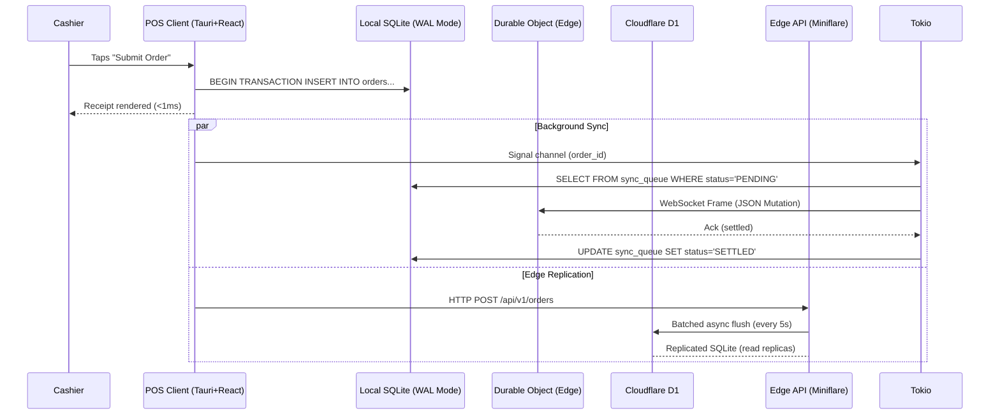

# 04_hexagonal-architecture.md - Hexagonal Architecture Deep Dive for PlinthOS

**Author**: PlinthOS Documentation Team  
**Version**: 0.1.0  
**Last Reviewed**: 2026-08-28  
**Related Files**: 
- `01_env-setup.md` (environment init)
- `02_local-development.md` (running components)
- `03_testing-workflow.md` (tests align with these boundaries)
- `05_bounded-contexts.md` (context-specific architecture details)
- `06_domain-modeling-patterns.md` (domain modeling within hexagonal structure)
- `DEVELOPER-NAVIGATION.md` (master navigation)
- `AGENTS.md` (project-wide standards and conventions)

---

## 4.1 Hexagonal Architecture (Ports & Adapters) Overview

PlinthOS is built using the **Hexagonal Architecture** (also known as Ports & Adapters pattern). This architectural style ensures that the pure domain logic is completely isolated from infrastructure, frameworks, and external dependencies.

### Core Principle

The domain core (`packages/core-domain`) has **zero infrastructure dependencies**. It knows nothing about:
- Databases (SQLite, D1, PostgreSQL)
- Web frameworks (React, Next.js, Cloudflare Workers)
- Mobile frameworks (Tauri, iOS, Android)
- Messaging systems (WebSocket, TCP, Kafka)

Instead, it interacts through **ports** (abstract interfaces/traits), and the **adapters** (concrete implementations) connect the core to the outside world.

### The Architecture Diagram

```mermaid
flowchart TB
    %% Styles
    classDef core fill:#e8f5e9,stroke:#2e7d32,stroke-width:2px
    classDef port fill:#e3f2fd,stroke:#1976d2,stroke-width:2px
    classDef adapter fill:#fff3e0,stroke:#fb8c00,stroke-width:2px
    classDef infra fill:#ffebee,stroke:#c62828,stroke-width:2px

    %% core domain - pure Rust, zero infra deps
    subgraph CoreDomain["packages/core-domain (Pure Rust Core)"]
        direction TB
        DC1["Order Aggregate Root"]
        DC2["KitchenTicket State Machine"]
        DC3["Inventory Calculator"]
        DC4["Tenant Billing Aggregates"]
        DC5["Value Objects: Money, Tax, Discount"]
        DC6["Domain Events: OrderCreated, ItemAdded, etc."]
        
        DC1 --> DC2 --> DC3 --> DC4
        DC5 --> DC1
        DC6 --> DC1
    end

    %% inbound adapters - driven by user/app action
    subgraph InboundPorts["Inbound Ports (Application Services)"]
        IP1["OrderApplicationService Trait"]
        IP2["KitchenApplicationService Trait"]
        IP3["InventoryApplicationService Trait"]
    end

    %% outbound ports - repository/gateway interfaces
    subgraph OutboundPorts["Outbound Ports (Repository & Gateway Traits)"]
        OP1["OrderRepository Trait"]
        OP2["KitchenRepository Trait"]
        OP3["InventoryRepository Trait"]
        OP4["PrintGateway Trait"]
        OP5["SyncGateway Trait"]
    end

    %% inbound adapters - react/tauri/wgpu/etc
    subgraph InboundAdapters["Inbound Adapters (Drivers)"]
        A1["Tauri IPC Commands (POS)"]
        A2["React Components (Dashboard)"]
        A3["Cloudflare Worker Routes (Edge API)"]
        A4["Hurl Contract Tests"]
    end

    %% outbound adapters - actual implementations
    subgraph OutboundAdapters["Outbound Adapters (Driven)"]
        OA1["SqliteOrderRepository (rusqlite)"]
        OA2["CloudflareD1Repository (worker-rs)"]
        OA3["NetworkEscPosPrinter (TcpStream)"]
        OA4["CloudflareDurableObjectAdapter (WebSocket)"]
        OA4a["KafkaMutationPublisher (future)"]
    end

    %% Connections
    %% Core receives from inbound ports
    IP1 --> DC1
    IP2 --> DC2
    IP3 --> DC3

    %% Core sends to outbound ports
    DC1 --> OP1
    DC2 --> OP2
    DC3 --> OP3
    DC4 --> OP1  %% billing flows through order repo

    %% Adapters implement ports/traits
    A1 --> IP1  %% Tauri implements OrderApplicationService
    A2 --> IP3  %% React implements Inventory service (via IPC)
    A3 --> IP1  %% Worker routes implement services

    OA1 --> OP1  %% rusqlite implements OrderRepository trait
    OA2 --> OP2  %% D1 implements KitchenRepository trait
    OA3 --> OP4  %% TCP implements PrintGateway trait
    OA4 --> OP5  %% DO implements SyncGateway trait

    %% CI/Test boundaries
    class CoreDomain core
    class IP1,IP2,IP3,OP1,OP2,OP3,OP4,OP5 port
    class A1,A2,A3,A4 adapter
    class OA1,OA2,OA3,OA4 adapter
```

### 4.1.1 Key Relationships

| Direction | Meaning | Example |
|---|---|---|
| **Core → Outbound Port** | Core declares what it needs | `OrderRepository::find_by_id(id)` trait method |
| **Adapter → Port** | Adapter fulfills the contract | `SqliteOrderRepository` implements `OrderRepository` trait |
| **Inbound Port → Core** | Application service triggers domain logic | `OrderApplicationService::place_order(payload)` |
| **Adapter → Inbound Port** | Driver calls service | `Tauri command -> OrderApplicationService` |
| **Core → Domain Events** | State changes emit events | `OrderEvent::ItemAdded` → triggers KDS update |
| **Events → Adapters** | Adapters react to events | `DurableObjectAdapter` receives event and flushes to D1 |

### 4.1.2 Why This Architecture?

| Benefit | Description |
|---|---|
| **Testability** | Domain logic can be tested without databases or HTTP servers |
| **Framework Agnostic** | Swap React for Vue, Rust for Go, SQLite for PostgreSQL without changing core |
| **Isolation** | Infrastructure failures don't corrupt domain invariants |
| **Hexagonal Core** | Pure domain in `core-domain` has zero async runtime, zero DB dependencies |
| **Multiple Representations** | Same core can power POS terminal, web dashboard, KDS, and future mobile apps |

---

## 4.2 Inbound Ports (Application Services)

Inbound ports define the **application services** that orchestrate domain operations. They are traits (Rust) or interfaces (TypeScript) that inbound adapters implement.

### 4.2.1 OrderApplicationService (Core Trait)

**Location**: Defined in `packages/core-domain/src/ports.rs` (or similar port definition module)

```rust
#[async_trait::async_trait]
pub trait OrderApplicationService: Send + Sync {
    /// Create a new order draft
    async fn create_order(
        &self,
        tenant_id: TenantId,
        location_id: LocationId,
        terminal_id: TerminalId,
        channel: OrderChannel,
        created_by: StaffMemberId,
        table_id: Option<FloorTableId>,
        seat_number: Option<SeatNumber>,
    ) -> Result<(Order, OrderEvent), OrderError>;

    /// Add item to existing order
    async fn add_item_to_order(
        &self,
        order_id: OrderId,
        item: OrderLineItem,
    ) -> Result<OrderEvent, OrderError>;

    /// Settle order after payment verification
    async fn settle_order(
        &self,
        order_id: OrderId,
        applicability: &GstApplicability,
    ) -> Result<OrderEvent, OrderError>;

    /// Void order with supervisor authorization
    async fn void_order(
        &self,
        order_id: OrderId,
        reason: String,
        voided_by: StaffMemberId,
        is_supervisor: bool,
    ) -> Result<OrderEvent, OrderError>;
}
```

**Implementations**:
- `TauriOrderService` - implements via IPC from POS client
- `EdgeOrderService` - implements via HTTP routes in edge API
- `TestOrderService` - mock implementation for testing

### 4.2.2 KitchenApplicationService

**Defines**: Ticket state transitions, bump workflow, SLA timers.

**Key Methods**:
- `start_prep(ticket_id: TicketId) -> Result<TicketEvent, KDSError>`
- `mark_ready(ticket_id: TicketId) -> Result<TicketEvent, KDSError>`
- `bump_ticket(ticket_id: TicketId) -> Result<TicketEvent, KDSError>`
- `cancel_ticket(ticket_id: TicketId, reason: String) -> Result<TicketEvent, KDSError>`

### 4.2.3 InventoryApplicationService

**Defines**: Stock deduction, reorder alerts, recipe-based inventory changes.

**Key Methods**:
- `deduct_stock(recipe_id: MenuItemId, quantity: u32) -> Result<StockDelta, InventoryError>`
- `check_reorder_thresholds() -> Vec<LowStockAlert>`
- `adjust_stock(item_id: StockItemId, delta: i32) -> Result<StockAdjustment, InventoryError>`

---

## 4.3 Outbound Ports (Repository & Gateway Traits)

Outbound ports define **what the core needs from the infrastructure layer**. The core never calls database APIs directly; it always goes through these traits.

### 4.3.1 OrderRepository Trait

```rust
#[async_trait::async_trait]
pub trait OrderRepository: Send + Sync {
    /// Find order by ID (with tenant isolation)
    async fn find_by_id(&self, order_id: OrderId) -> Result<Order, DbError>;
    
    /// Find orders by tenant and status
    async fn find_by_tenant_and_status(
        &self,
        tenant_id: TenantId,
        status: OrderStatus,
    ) -> Result<Vec<Order>, DbError>;
    
    /// Save (insert or update) an order
    async fn save(&self, order: &Order) -> Result<(), DbError>;
    
    /// Soft-delete an order
    async fn soft_delete(&self, order_id: OrderId) -> Result<(), DbError>;
    
    /// Count orders by filter
    async fn count_by_tenant(&self, tenant_id: TenantId) -> Result<u64, DbError>;
}
```

**Implementations**:
- `SqliteOrderRepository` - `packages/edge-api/src/db/mod.rs` uses `rusqlite`
- `CloudflareD1Repository` - D1 SQLite bindings via `worker-rs`
- `MockOrderRepository` - in-memory for testing

**Key Invariants** (per `AGENTS.md` and `core-domain`):
- **Multi-tenant isolation**: Every query mandatorily binds `tenant_id` and `location_id`
- **No raw SQL in core**: Core only knows about the trait methods; SQL is in adapters only
- **Financial precision**: All Money values use `rust_decimal::Decimal`; adapters convert from DB rows

### 4.3.2 KitchenRepository Trait

```rust
pub trait KitchenRepository: Send + Sync {
    fn find_ticket_by_id(&self, ticket_id: TicketId) -> Result<KitchenTicket, DbError>;
    fn save_ticket(&self, ticket: &KitchenTicket) -> Result<(), DbError>;
    fn update_ticket_status(&self, ticket_id: TicketId, status: TicketStatus) -> Result<(), DbError>;
    fn add_line_item(&self, ticket_id: TicketId, item: TicketLineItem) -> Result<(), DbError>;
    fn remove_line_item(&self, ticket_id: TicketId, item_id: TicketId) -> Result<(), DbError>;
}
```

### 4.3.3 InventoryRepository Trait

```rust
pub trait InventoryRepository: Send + Sync {
    fn find_stock_item(&self, item_id: StockItemId) -> Result<StockItem, DbError>;
    fn update_stock_level(&self, item_id: StockItemId, new_quantity: i32) -> Result<(), DbError>;
    fn check_reorder_alerts(&self, tenant_id: TenantId) -> Result<Vec<LowStockAlert>, DbError>;
    fn deduct_from_recipe(&self, recipe_id: MenuItemId, quantity: u32) -> Result<StockDelta, DbError>;
}
```

### 4.3.4 PrintGateway Trait

```rust
pub trait PrintGateway: Send + Sync {
    fn print_receipt(&self, receipt_data: ReceiptData) -> Result<(), PrintError>;
    fn print_kot(&self, kot_data: KOTData) -> Result<(), PrintError>;
    fn test_connection(&self) -> Result<bool, PrintError>;
}
```

**Implementations**:
- `NetworkEscPosPrinter` - TCP socket to physical ESC/POS printer
- `MockPrintGateway` - for development without printer attached
- `DurableObjectPrintGateway` - WebSocket-based for future architectures

### 4.3.5 SyncGateway Trait

```rust
pub trait SyncGateway: Send + Sync {
    fn publish_mutation(&self, mutation: MutationEnvelope) -> Result<(), SyncError>;
    fn subscribe_mutations(&self, callback: impl Fn(MutationEnvelope)) -> Result<(), SyncError>;
    fn get_sync_status(&self) -> Result<SyncStatus, SyncError>;
    fn reconcile_offline_changes(&self, changes: Vec<MutationEnvelope>) -> Result<(), DbError>;
}
```

**Implementations**:
- `CloudflareDurableObjectAdapter` - WebSocket singleton per restaurant location
- `KafkaMutationPublisher` - future distributed pub/sub (not yet implemented)
- `MockSyncGateway` - in-memory for local development testing

---

## 4.4 Inbound Adapters (Drivers)

Inbound adapters are the **concrete implementations** that call inbound ports. They are the "drivers" - they drive the domain core.

### 4.4.1 Tauri IPC Adapters (POS Client)

**Location**: `apps/pos-client/src/commands/` and `apps/pos-client/src/adapters/`

**Pattern**: Tauri commands (`#[tauri::command]`) that receive JSON from React, call the appropriate application service, and return results.

**Example**: `submit_order` Tauri command:

```rust
#[tauri::command]
pub async fn submit_order(payload: OrderPayload) -> Result<OrderReceipt, String> {
    let service = get_order_service(); // injected via Tauri state
    service.place_order(payload).await
        .map_err(|e| e.to_string())
}
```

**IPC Flow**:
```
React UI --JSX form submission--> Tauri invoke("submit_order", payload)
Tauri command --calls--> OrderApplicationService trait
Trait --executes--> Order domain aggregate (invariants checked)
Domain --emits--> OrderEvent::Settled (or ItemAdded, etc.)
Trait --returns--> Receipt struct
React --renders--> Optimistic UI update + KDS notification
```

### 4.4.2 React Dashboard Adapters

**Location**: `apps/web-dashboard/src/adapters/` or `src/hooks/`

**Pattern**: Custom React hooks that call the edge API (Cloudflare Workers) via `fetch()`.

**Example**: `useOrderCreation` hook:

```tsx
import { useState } from 'react';
import { OrderFormValues } from '@/types/order';

export function useOrderCreation() {
  const [loading, setLoading] = useState(false);
  const [error, setError] = useState<string | null>(null);

  const createOrder = async (values: OrderFormValues) => {
    setLoading(true);
    setError(null);
    
    try {
      const response = await fetch(`${import.meta.env.VITE_API_URL}/api/v1/orders`, {
        method: 'POST',
        headers: {
          'Content-Type': 'application/json',
          'X-Store-Id': storeId,
          'Authorization': `Bearer ${jwtToken}`,
        },
        body: JSON.stringify(values),
      });
      
      if (!response.ok) {
        const err = await response.text();
        throw new Error(err || 'Failed to create order');
      }
      
      const data = await response.json();
      setLoading(false);
      return data;
    } catch (e) {
      setError(e instanceof Error ? e.message : 'Unknown error');
      setLoading(false);
      throw e;
    }
  };

  return { createOrder, loading, error };
}
```

**API Flow**:
```
React Dashboard --fetch API call--> Edge API (Miniflare local / Cloudflare prod)
Edge API --validates JWT+tenant--> TenantDbSession (enforces isolation)
Edge API --calls--> OrderApplicationService trait
Trait --> OrderRepository adapter (rusqlite / D1)
Repository --> D1 SQLite (persists order)
Domain --emits--> OrderEvent
Edge API --returns--> JSON response
React --updates--> UI state, shows success notification
```

### 4.4.3 Cloudflare Worker Routes

**Location**: `apps/edge-api/src/routes/` (as defined in `router.rs`)

**Pattern**: `worker-rs` Router with data injection (auth_context from JWT middleware).

**Example Route Registration** (from `router.rs`):

```rust
pub fn build_router(auth_context: Option<TenantContext>) -> Router<'static, Option<TenantContext>> {
    let router = Router::with_data(auth_context);
    let router = crate::routes::auth::register(router);
    let router = crate::routes::inventory::register(router);
    let router = crate::routes::orders::register(router);
    let router = crate::routes::kds::register(router);
    let router = crate::routes::menu::register(router);
    let router = crate::routes::audit::register(router);
    let router = crate::routes::eod::register(router);
    let router = crate::routes::reports::register(router);
    let router = crate::routes::ws::register(router);
    router
}
```

**Each route module** (e.g., `orders.rs`) registers endpoints that:
1. Extract auth context (or return 401/403)
2. Call application service trait
3. Return JSON response

**See** `apps/edge-api/src/routes/orders.rs` for full implementation patterns.

### 4.4.4 Hurl Contract Tests as Adapters

**Location**: `tests/api/*.hurl`

**Pattern**: Hurl tests serve as both documentation and inbound adapter verification. They drive the API endpoints and verify responses match expected schemas.

**Role**: While not "adapters" in the hexagonal sense, Hurl tests ensure that the inbound adapters (Tauri, React, Worker routes) produce correct behavior. They are the **consumer-facing verification** of the ports.

---

## 4.5 Outbound Adapters (Driven Implementations)

Outbound adapters are the **concrete implementations** of the outbound port traits. They connect the domain core to external infrastructure (databases, APIs, printers, etc.).

### 4.5.1 SqliteOrderRepository (rusqlite Implementation)

**Location**: `apps/edge-api/src/db/mod.rs` or `packages/` if shared.

**Key Features** (per codebase exploration):
- Uses `rusqlite` with WAL mode (`PRAGMA journal_mode = WAL;`)
- `PRAGMA synchronous = NORMAL` (per README.md hexagonal architecture flow)
- Multi-tenant isolation: every query binds `tenant_id` and `location_id`
- Prepared statements for performance and safety
- Transactions for atomic operations (order creation = atomic insert + sync queue insert)

**Sample Method** (inferred from patterns):

```rust
pub struct SqliteOrderRepository {
    db: SqliteConnection, // rusqlite::Connection
}

impl OrderRepository for SqliteOrderRepository {
    async fn find_by_id(&self, order_id: OrderId) -> Result<Order, DbError> {
        let sql = "SELECT * FROM orders WHERE order_id = ? AND tenant_id = ? AND location_id = ?";
        let stmt = self.db.prepare(sql)?;
        let order: Order = stmt.query_row([
            &order_id.to_string(),
            &tenant_id.to_string(),
            &location_id.to_string(),
        ])?;
        Ok(order)
    }
    
    async fn save(&self, order: &Order) -> Result<(), DbError> {
        use rusqlite::Transaction;
        let tx = self.db.transaction()?;
        
        // Insert order
        let order_sql = "INSERT INTO orders (...) VALUES (...)";
        tx.execute(order_sql, [...])?;
        
        // Insert line items
        for item in &order.items {
            let item_sql = "INSERT INTO order_line_items ...";
            tx.execute(item_sql, [...])?;
        }
        
        tx.commit()?;
        Ok(())
    }
}
```

**Financial Precision**: All `Money` values stored as minor units (integer cents) in DB, converted to/from `rust_decimal::Decimal` in the domain layer.

### 4.5.2 CloudflareD1Repository (D1 Implementation)

**Location**: `apps/edge-api/src/db/` 

**Key Features**:
- Uses `worker-rs` D1 bindings (`Database`, `Statement`, `Row`)
- Multi-tenant isolation same as SqliteOrderRepository
- Periodic batched flush from Durable Objects (per README.md D1 design)
- Vector clock awareness for sync protocol

**Sample Method**:

```rust
pub struct D1OrderRepository {
    db: &'a worker::d1::Database,
    tenant_id: TenantId,
    location_id: LocationId,
}

impl OrderRepository for D1OrderRepository {
    async fn find_by_id(&self, order_id: OrderId) -> Result<Order, DbError> {
        let sql = "SELECT * FROM orders WHERE order_id = ? AND tenant_id = ? AND location_id = ?";
        let stmt = self.db.prepare(sql)?;
        let row = stmt.bind(&[
            &order_id.to_string(),
            &self.tenant_id.to_string(),
            &self.location_id.to_string(),
        ])?.fetch_optional()?;
        
        row.map(|r| Order::from(r)).ok_or(DbError::OrderNotFound)
    }
}
```

### 4.5.3 NetworkEscPosPrinter (TCP Implementation)

**Location**: `apps/pos-client/src/adapters/printer/`

**Key Features**:
- Connects to physical ESC/POS printer via TCP socket
- Sends ESC/POS raw byte commands (bold, underline, cut paper, etc.)
- Fallback to virtual printer for development
- Handles connection drops and reconnection

**Sample Method**:

```rust
pub struct NetworkEscPosPrinter {
    addr: String,  // e.g., "192.168.1.100:9100"
    stream: Option<TcpStream>,
}

impl PrintGateway for NetworkEscPosPrinter {
    fn print_receipt(&self, receipt_data: ReceiptData) -> Result<(), PrintError> {
        let mut stream = match &self.stream {
            Some(s) => s.clone(),
            None => {
                // Connect
                let new_stream = TcpStream::connect(&self.addr)?;
                new_stream.set_nonblocking(false)?;
                Some(new_stream)
            }
        };
        
        let bytes = receipt_data.to_esc_pos_bytes();
        stream.write_all(&bytes)?;
        Ok(())
    }
    
    fn test_connection(&self) -> Result<bool, PrintError> {
        match &self.stream {
            Some(s) => Ok(s.is_writable()),
            None => {
                // Attempt connection
                match TcpStream::connect_timeout(&self.addr, Duration::from_secs(2)) {
                    Ok(_) => Ok(true),
                    Err(_) => Ok(false),
                }
            }
        }
    }
}
```

### 4.5.4 CloudflareDurableObjectAdapter (WebSocket Implementation)

**Location**: `apps/edge-api/src/durable_objects/sync_room.rs`

**Key Features** (per README.md D1 design and `apps/edge-api/src/lib.rs`):
- One Durable Object per restaurant location (`LocationSyncRoom`)
- WebSocket connections to all connected POS registers and KDS devices
- Broadcasts 86 invalidation, order events, status updates
- Vector clock ordering for mutation sequence
- Periodic batched flush to D1 (every 5 seconds or on order settlement)

**Vector Clock Concept** (per sync-protocol crate):
- Each mutation has a vector clock (map of node_id → sequence_number)
- Ensures causal ordering across concurrent writes
- Detects conflicts when vector clocks are incomparable

**Core Methods**:

```rust
pub struct LocationSyncRoom {
    pub(crate) id: DurableObjectId,
    pub(crate) connections: HashMap<WebSocket, Vec<u8>>, // ws -> pending mutations
    pub(crate) vector_clock: VectorClock,
}

impl LocationSyncRoom {
    pub async fn broadcast(&self, mutation: &MutationEnvelope) {
        let payload = serde_json::to_vec(mutation).unwrap();
        for (ws, _) in &self.connections {
            let _ = ws.send(&payload).await;
        }
    }
    
    pub async fn handle_message(&mut self, message: &str) {
        let mut mutation: MutationEnvelope = serde_json::from_str(message).unwrap();
        self.vector_clock.update(&mutation.id);
        // Apply mutation to in-memory state
        // Broadcast delta to all connections
        self.broadcast(&mutation).await;
        // Periodic flush to D1
    }
}
```

### 4.5.5 Mock Implementations (for Testing)

**Purpose**: Allow domain logic and application service tests to run without actual databases, printers, or cloud services.

**Examples**:
- `MockOrderRepository` - In-memory `HashMap<OrderId, Order>`; returns results instantly
- `MockPrintGateway` - No-op; just logs print data
- `MockSyncGateway` - In-memory broadcast to subscribed callbacks
- `MockKitchenRepository` - In-memory ticket store

**Usage in Tests** (per `core-domain` test patterns):

```rust
use core_domain::ports::{OrderRepository, PrintGateway};
use core_domain::models::order::Order;

#[test]
fn test_order_creation_with_mock_repo() {
    let repo = MockOrderRepository::new();
    let service = MockOrderApplicationService::new(repo);
    
    let (order, event) = service.create_order(
        tenant_id,
        location_id,
        terminal_id,
        OrderChannel::DineIn,
        staff_id,
        None,
        None,
    ).await.unwrap();
    
    assert_eq!(event.event_type, OrderEventType::Created);
    assert!(order.is_draft());
}
```

---

## 4.6 Hexagonal Architecture Benefits (Reiteration)

| Benefit | How PlinthOS Implements It |
|---|---|
| **Test Domain Logic Without DB** | Use `MockOrderRepository` in `cargo test --workspace`; no SQLite needed for unit tests |
| **Swap Database Technology** | Switch from `rusqlite` → `sqlx` → `sea-query` without changing `core-domain` |
| **Swap UI Framework** | Replace React+Tauri with Flutter or native iOS/Android; core domain unchanged |
| **Isolate Infrastructure Bugs** | Printer TCP timeout doesn't affect order state machine; D1 latency doesn't affect local POS |
| **Multiple Simultaneous Representations** | Same `core-domain` powers: Tauri POS terminal, Next.js dashboard, Cloudflare Workers edge API, future React Native app |
| **Domain-First Development** | New developers start with `core-domain` invariants; infrastructure comes later |

---

## 4.7 Diagrams Summary

### Full Hexagonal Architecture (Ports & Adapters)

```mermaid
flowchart TB
    classDef core fill:#e8f5e9,stroke:#2e7d32,stroke-width:2px
    classDef port fill:#e3f2fd,stroke:#1976d2,stroke-width:1.5px,stroke-dasharray: 5 5
    classDef adapter fill:#fff3e0,stroke:#fb8c00,stroke-width:1.5px
    classDef event fill:#e1f5fe,stroke:#01579b,stroke-width:1px,stroke-dasharray: 2 2
    
    subgraph CoreDomain["packages/core-domain (Pure Rust)"]
        direction TB
        Order[Aggregate Root: Order]
        Ticket[Aggregate Root: KitchenTicket]
        Inventory[Aggregate Root: StockItem]
        Money[Value Object: Money]
        Events[Domain Events]
    end
    
    subgraph InboundPorts["Inbound Ports (Application Services)"]
        IP1[OrderApplicationService]
        IP2[KitchenApplicationService]
        IP3[InventoryApplicationService]
    end
    
    subgraph OutboundPorts["Outbound Ports (Repositories & Gateways)"]
        OP1[OrderRepository]
        OP2[KitchenRepository]
        OP3[InventoryRepository]
        OP4[PrintGateway]
        OP5[SyncGateway]
    end
    
    subgraph InboundAdapters["Inbound Adapters (Drivers)"]
        A1[Tauri IPC → IP1]
        A2[React → IP3 via fetch]
        A3[Cloudflare Worker → IP1]
        A4[Hurl Tests → API verification]
    end
    
    subgraph OutboundAdapters["Outbound Adapters (Driven)"]
        OA1[SqliteOrderRepository → OP1]
        OA2[D1OrderRepository → OP1]
        OA3[KafkaPublisher → OP5 (future)]
        OA4[NetworkEscPosPrinter → OP4]
        OA5[CloudflareDurableObject → OP5]
    end
    
    %% Connections
    InboundPorts --> CoreDomain
    CoreDomain --> OutboundPorts
    InboundAdapters --> InboundPorts
    OutboundAdapters --> OutboundPorts
    
    %% Events flow
    CoreDomain --> Events
    Events --> InboundAdapters
    Events --> OutboundAdapters
    
    style CoreDomain core
    style InboundPorts port
    style OutboundPorts port
    style InboundAdapters adapter
    style OutboundAdapters adapter
```

### Simplified Flow: Local Write → Edge Sync



---

## 4.8 Code Conventions Within Hexagonal Architecture

### Rust Side (core-domain)

```rust
#![forbid(unsafe_code)]  // Mandatory per AGENTS.md
#![deny(unused_imports)]
#![warn(missing_docs)]    // Docs required on public items

use rust_decimal::Decimal;  // ALL financial calculations
use chrono::Utc;            // Time-stamping
use serde::{Serialize, Deserialize};  // Persistence / API serialization
use thiserror::Error;       // Domain-specific error types

#[derive(Debug, Clone, PartialEq, Eq, Serialize, Deserialize, specta::Type)]
pub struct OrderLineItem {
    pub id: OrderLineItemId,
    pub menu_item_id: MenuItemId,
    pub name: String,
    pub base_price: Money,        // Money = Decimal-based value object
    pub modifier_selections: Vec<ModifierSelection>,
    pub modifier_total: Money,
    pub unit_price: Money,        // base_price + modifiers delta
    pub quantity: u32,
    pub fired_quantity: u32,
    pub tax_rate: GstRate,
    pub notes: Option<String>,
    pub seat_number: Option<SeatNumber>,
}
```

### TypeScript Side (apps/)

```typescript
// Strict mode enforced: no `any`, strict: true, noImplicitAny: true
// per AGENTS.md TypeScript Quality Standards

export interface OrderLineItem {
  id: string;  // UUID v7, not "any"
  menuItemId: string;
  name: string;
  basePrice: number;  // Stored as minor units (cents) internally, converted to Decimal for calcs
  modifierSelections: string[];  // Modifier IDs
  modifierTotal: number;
  unitPrice: number;
  quantity: number;
  firedQuantity: number;
  taxRate: 'GST-5' | 'GST-10' | 'GST-0';  // Enum, not string
  notes?: string;
  seatNumber?: string;
}
```

### Port/Trait Definitions

```rust
// In core-domain ports.rs (or equivalent)
#[async_trait::async_trait]
pub trait OrderRepository: Send + Sync {
    async fn find_by_id(&self, id: OrderId) -> Result<Order, DbError>;
    async fn save(&self, order: &Order) -> Result<(), DbError>;
    // ... other methods
}

// In edge-api implementations
pub struct SqliteOrderRepository { /* ... */ }
impl OrderRepository for SqliteOrderRepository { /* ... */ }

// In test mocks
pub struct MockOrderRepository { /* in-memory */ }
impl OrderRepository for MockOrderRepository { /* ... */ }
```

---

## 4.9 Next Steps After Understanding Hexagonal Architecture

After reading this file, the recommended progression is:

1. **Read** `05_bounded-contexts.md` to see how hexagonal architecture maps to DDD bounded contexts
2. **Read** `06_domain-modeling-patterns.md` to see concrete domain models within this structure
3. **Explore** `packages/core-domain/src/` starting with `lib.rs` → `models/order.rs` → `ports.rs`
4. **Look at** an adapter implementation: `apps/edge-api/src/db/mod.rs` (SqliteOrderRepository) or `apps/pos-client/src/adapters/`
5. **Try** running `cargo test --workspace` - notice how domain tests don't need a database running (mock repos used)
6. **Examine** a Hurl test: `tests/api/create_order.hurl` - see how it verifies the inbound adapter → port → core flow

---

## 4.10 Version & Change Log

| Version | Date | Author | Changes |
|---|---|---|---|
| 0.1.0 | 2026-08-28 | Docs Team | Initial release - hexagonal architecture deep dive |
| 0.1.1 | YYYY-MM-DD | TBD | Updates based on contributor feedback |
| 0.2.0 | YYYY-MM-DD | TBD | Major overhaul for new architectural patterns |

---
*This file is part of the PlinthOS internal developer documentation set. See `01_env-setup.md` for environment initialization, `02_local-development.md` for running components, and `03_testing-workflow.md` for testing patterns aligned with these architecture boundaries.*