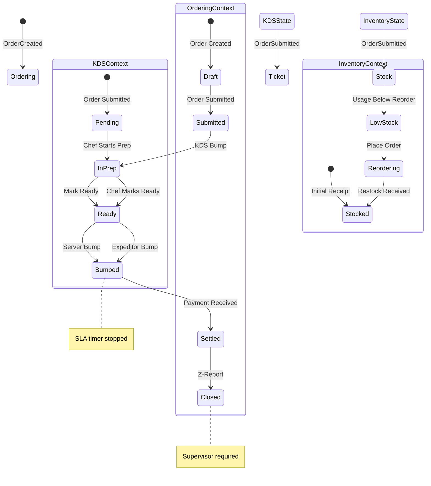

# 05_bounded-contexts.md - Bounded Contexts Overview for PlinthOS

**Author**: PlinthOS Documentation Team  
**Version**: 0.1.0  
**Last Reviewed**: 2026-08-28  
**Related Files**: 
- `04_hexagonal-architecture.md` (structural pattern these contexts use)
- `06_domain-modeling-patterns.md` (concrete models per context)
- `07_rust-safety-mandates.md` (safety rules that apply across contexts)
- `AGENTS.md` (project conventions including branch naming, commit format)
- `DEVELOPER-NAVIGATION.md` (master navigation for developer docs)

---

## 5.1 Why Bounded Contexts?

PlinthOS is decomposed into **four strict Bounded Contexts** per the Domain-Driven Design (DDD) approach documented in `README.md` and this guide. Each context maintains its own:

- **Ubiquitous Language**: Shared vocabulary within the context, different across contexts
- **Aggregate Roots**: Primary entities with lifecycle management
- **Domain Events**: State change notifications within the context
- **Invariants**: Validation rules that must always hold
- **Database Schema**: Tables and indexes specific to the context

### The Key Insight

> **A single concept can have different meanings in different contexts.**

Example: "Order" means different things in each context:
- **Ordering Context**: A draft order being built, items can be added/removed, not yet paid
- **Kitchen Execution Context**: A ticket that has been submitted, moving through prep states (Pending → In Prep → Ready → Bumped)
- **Tenant Billing Context**: A settled order, used for Z-report generation and revenue calculation
- **Inventory Context**: An order that triggers stock deduction against recipes

Each context only knows what it needs; they don't share internal models.

---

## 5.2 The Four Bounded Contexts

### 5.2.1 Ordering Context (The "Front Door")

**Core Responsibility**: Receiving, modifying, and transitioning orders from draft → settled.

**Ubiquitous Language**:
- `Draft` - Initial state, items can be added
- `Submitted` - Order sent to kitchen, no more modifications
- `InPrep` - Kitchen has acknowledged (via KDS bump)
- `Ready` - Chef marks item ready
- `Bumped` - Item served/expedited
- `Settled` - Payment received, order closed
- `Voided` - Supervisor cancelled order

**Aggregate Root**: `Order` (in `packages/core-domain/src/models/order.rs`)

**Key Invariants**:
- $\sum \text{(Seat Check Totals)} = \text{Order Total}$ (seat balance validation)
- Price calculations must use `rust_decimal::Decimal` (no `f64`/`f32`)
- A ticket cannot transition to `BUMPED` before `IN_PREP` (unless fast-tracked by policy)
- Cannot settle order with incomplete payment (`InsufficientPayment` error)

**Primary Domain Events**:
- `OrderCreated` - When order draft is first created
- `ItemAdded` - When line item added to order
- `ItemQuantityChanged` - When quantity modified
- `ItemRemoved` - When line item removed
- `DiscountApplied` / `DiscountRemoved` - Promotion handling
- `ChargeAdded` - Surcharges, fees
- `PaymentRecorded` - Customer tenders payment
- `TipAdded` - Gratuity
- `OrderSettled` - Order fully paid, can close check
- `OrderVoided` - Supervisor cancels

**Related Code Artifacts**:
- `packages/core-domain/src/models/order.rs` - Full Order aggregate
- `packages/core-domain/src/events/order.rs` - Order event definitions
- `packages/core-domain/src/enums/order_status.rs` - Status enum variants
- `packages/core-domain/src/enums/order_channel.rs` - DineIn, Takeout, Delivery, Kiosk
- `apps/edge-api/routes/orders.rs` - HTTP API for order lifecycle
- `apps/pos-client/src/` - Tauri IPC commands for order taking

**Context Boundary**: 
- Nothing from other contexts should be imported into Ordering context's core models
- If kitchen status is needed, use domain events (`KitchenTicketBumped`) not direct model access
- Financial calculations isolated here (rust_decimal mandated)

---

### 5.2.2 Kitchen Execution Context (The "Back House")

**Core Responsibility**: Managing ticket lifecycle states, SLA timers, course-stage tracking, and kitchen communication.

**Ubiquitous Language**:
- `Ticket` - KDS header for a specific order (or subset thereof)
- `TicketLine` - Individual line item on the kitchen display with preparation instructions
- `StationId` - GRILL_01, SALAD_01, PASTA_01, etc.
- `CourseStage` - APPETIZER, MAIN, DESSERT, DRINKS
- `PreparationSLA` - Green <8m, Yellow 8-12m, Red >15m
- `Bump` - Server/expeditor marks item as served
- `Fast-Track` - Priority bypass (authorized roles only)

**Aggregate Root**: `KitchenTicket` (in `packages/core-domain/src/models/`)

**Key Invariants**:
- A ticket line cannot transition to `BUMPED` before transitioning to `IN_PREP` (unless fast-tracked)
- SLA timer starts when ticket enters `PENDING` state
- Green/Syellow/Red thresholds: <8m, 8-12m, >15m respectively
- Course stages must be sequential (appetizers before main courses typically)
- Station assignments balance workload across kitchen stations

**Primary Domain Events**:
- `TicketCreated` - When order items routed to KDS
- `TicketLineAdded` - Item line added to ticket
- `LineStatusChanged` - PENDING → IN_PREP → READY → BUMPED
- `CourseStageUpdated` - Current course stage for ticket
- `SLAStatusChanged` - Green → Yellow → Red (timer-based)
- `TicketBumped` - Server marks item served/collected
- `TicketCancelled` - Void/override by manager

**Related Code Artifacts**:
- `packages/core-domain/src/models/kitchen.rs` - KitchenTicket aggregate
- `packages/core-domain/src/models/ticket_line.rs` - TicketLine entity
- `packages/core-domain/src/enums/order_status.rs` - Status transitions
- `packages/core-domain/src/events/kitchen.rs` - Kitchen event definitions
- `apps/pos-client/src/showcase/ShowcaseView.tsx` - May show KDS demo
- `apps/edge-api/routes/kds.rs` - KDS API routes (WebSocket + REST)

**Context Boundary**:
- Ordering context sends `ORDER_SUBMITTED` event; KDS context doesn't need order financial details
- KDS context emits `TicketBumped`; ordering context may listen for KPI tracking but doesn't direct KDS logic
- SLA timers are KDS-local; ordering context only sees final `OrderSettled`

---

### 5.2.3 Inventory Context (The "Stockroom")

**Core Responsibility**: Tracking stock levels, reorder alerts, recipe-based deductions, and wastage tracking.

**Ubiquitous Language**:
- `StockItem` - Physical inventory item (beef patty, rice, soda syrup)
- `Recipe` - Mapping of stock items to menu items (butter chicken recipe uses: 2 patties, 1 rice portion)
- `UnitQty` - Unit of measure (each, kg, liter, portion)
- `StockDelta` - Change in stock (positive = receipt, negative = deduction/wastage)
- `ReorderPoint` - Minimum threshold that triggers alert
- `MaximumStock` - Optimal ceiling for storage/financial reasons
- `Wastage` - Spoilage, error, trim (tracked separately from normal deduction)

**Aggregate Root**: `StockItem` (in `packages/core-domain/src/models/`)

**Key Invariants**:
- Recipe stock deduction occurs automatically upon receiving `ORDER_SUBMITTED` domain event
- Stock drops below `ReorderPoint` emit `INVENTORY_DISCREPANCY_ALERT`
- `UnitQty` conversions must be consistent (e.g., 1 kg = 1000 g)
- Wastage is tracked separately from normal recipe deductions
- Negative stock quantities are flagged as discrepancies (unless in-flight order)

**Primary Domain Events**:
- `StockAdjusted` - Manual or automatic quantity change
- `StockReorderAlert` - Stock below reorder point
- `RecipeDeducted` - Automatic deduction when order submitted
- `WastageRecorded` - Spoilage/error trim recorded
- `StockCountPerformed` - Physical inventory count recorded
- `MinimumStockMet` - Stock restocked above reorder point

**Related Code Artifacts**:
- `packages/core-domain/src/models/stock.rs` - StockItem aggregate
- `packages/core-domain/src/models/recipe.rs` - Recipe entity with item mappings
- `packages/core-domain/src/models/inventory.rs` - Inventory management logic
- `packages/core-domain/src/value_objects/measurement.rs` - UnitQty conversions
- `apps/edge-api/routes/inventory.rs` - Inventory API endpoints
- `packages/sync-protocol/` - CRDT-based offline sync for stock counts

**Context Boundary**:
- Inventory context doesn't know about order financial totals (tips, taxes, discounts)
- It only cares which menu items were ordered (menu_item_id references)
- Ordering context emits `ORDER_SUBMITTED`; Inventory context reacts with deductions
- No direct API calls from Inventory to Ordering context

---

### 5.2.4 Tenant Billing Context (The "Back Office")

**Core Responsibility**: Shift management, Z-reports, revenue analytics, tax liability, staff permissions, and multi-tenant isolation.

**Ubiquitous Language**:
- `StoreShift` - Till open/close cycle for a specific register/location
- `ZReport` - End-of-shift reconciliation (cash counts, card settlements, tips)
- `TaxLiability` - Computed GST/tax totals for reporting period
- `TenderBreakdown` - Payment method distribution (cash %, card %, UPI %)
- `ZVariance` - Discrepancy between expected and actual cash
- `SupervisorAuthorization` - Required for voids, Z-reports, shift close
- `RoleBasedAccess` - Cashier/Manager/Supervisor/Admin permissions

**Aggregate Root**: `StoreShift` (in `packages/core-domain/src/models/`)

**Key Invariants**:
- A shift cannot be closed (`Z-REPORT`) if active open checks remain associated with its register
- $\sum \text{(Tender Breakdown)} \approx \text{Total Revenue}$ (within small tolerance for rounding)
- Tax liability computed per `GstApplicability` rules per `core-domain` value objects
- Multi-tenant isolation: Every query mandatorily binds `tenant_id` and `location_id`
- Shift close requires supervisor permission (`is_supervisor: true`)
- Z-reports are immutable once generated (soft-delete pattern, never overwrite)

**Primary Domain Events**:
- `ShiftOpened` - Till start, float verification, cash count
- `ShiftClosed` - Z-report generation, final cash count, variance computed
- `ZReportGenerated` - Revenue summary, tender breakdown, tax totals
- `PaymentSettlement` - Payment recorded against shift
- `StaffRoleChanged` - Permission bitmask update
- `SupervisorOverride` - Used for voids, overrides normal invariant checks
- `TenantsMerged` / `TenantSplit` - Multi-entity management (enterprise scale)

**Related Code Artifacts**:
- `packages/core-domain/src/models/store_shift.rs` - StoreShift aggregate
- `packages/core-domain/src/models/z_report.rs` - ZReport entity
- `packages/core-domain/src/value_objects/tax.rs` - Tax liability computation
- `packages/core-domain/src/value_objects/tender_breakdown.rs` - Tender distribution
- `apps/web-dashboard/src/app/` - Dashboard shift management UI
- `apps/edge-api/routes/reports.rs` - Reports API (sales analytics)
- `cliff.toml` - May contain cliff/configuration for shift processes

**Context Boundary**:
- No other context should directly query StoreShift tables except Billing context
- Other contexts emit events that Billing may react to (e.g., `OrderSettled` → contributes to shift revenue)
- Tenant isolation is paramount; never cross `tenant_id` boundaries in Billing queries
- Role-based access control (`Permissions` bitmask) enforced in API middleware (per `edge-api/src/lib.rs` auth)

---

## 5.3 Context Mapping & Interactions

### 5.3.1 Context Mapping Diagram

```mermaid
graph TD
    subgraph OrderingContext["Ordering Context"]
        OC1[Order Aggregate]
        OC2[OrderLineItems]
        OC3[OrderEvents: Created, ItemAdded, Settled]
    end
    
    subgraph KDSContext["Kitchen Execution Context"]
        KC1[KitchenTicket Aggregate]
        KC2[TicketLines]
        KC3[KDSEvents: Bumped, Ready]
    end
    
    subgraph InventoryContext["Inventory Context"]
        IC1[StockItem Aggregate]
        IC2[Recipes]
        IC3[InventoryEvents: Deducted, Alert]
    end
    
    subgraph BillingContext["Tenant Billing Context"]
        BC1[StoreShift Aggregate]
        BC2[ZReports]
        BC3[BillingEvents: ShiftClosed, ZGenerated]
    end
    
    %% Inter-context events (one-way dependencies)
    OC3 -->|ORDER_SUBMITTED| KC1
    OC3 -->|ORDER_SUBMITTED| IC1
    OC3 -->|CHECK_SETTLED| BC1
    
    KC3 -->|TICKET_BUMPED| OC1 (KPI tracking only, doesn't direct)
    
    style OrderingContext fill:#e8f5e9,stroke:#2e7d32,stroke-width:2px
    style KDSContext fill:#e3f2fd,stroke:#1976d2,stroke-width:2px
    style InventoryContext fill:#fff3e0,stroke:#fb8c00,stroke-width:2px
    style BillingContext fill:#ffebee,rgba:#b71c1c,0.1,stroke-width:2px
```

### 5.3.2 One-Way Event Flow (Not Bidirectional)

**Important**: Context mappings are **one-way** - the emitting context doesn't know or care about the receiver's internal models.

| From → To | Event | Purpose | Bidirectional? |
|---|---|---|---|
| Ordering → KDS | `ORDER_SUBMITTED` | Send new tickets to kitchen | No |
| Ordering → Inventory | `ORDER_SUBMITTED` | Deduct stock automatically | No |
| KDS → Ordering | `TicketBumped` | KPI tracking (ordering doesn't change KDS logic) | No |
| Ordering → Billing | `CheckSettled` / `OrderSettled` | Revenue accounting | No |
| Inventory → Ordering | (none - reacts to ORDER_SUBMITTED only) | - | No |
| Billing → Ordering | (none - reads settled orders) | - | No |

**Why This Design**:
- **Loose Coupling**: Changes to KDS logic don't break order processing
- **Independent Scaling**: Each context can scale independently (different DB, different resources)
- **Team Autonomy**: Different teams can own different contexts without coordination on internal models
- **Error Isolation**: A bug in inventory deduction doesn't corrupt order state

---

## 5.4 Context-Specific Safety Mandates

While all contexts share the project-wide mandates from `AGENTS.md` and `07_rust-safety-mandates.md`, each has unique concerns:

### Ordering Context
- **Financial Precision**: ALL money calculations use `rust_decimal::Decimal` - enforced via clippy lints and `#![deny(unsafe_code)]`
- **Seat Balance**: $\sum \text{Seat Check Totals} = \text{Order Total}$ - validated on every `change_quantity` and `add_item`
- **Discount Logic**: Percentage vs FlatAmount handling; `compute_amount(&subtotal)` must return `Ok(Money)` not `Err`

### Kitchen Execution Context
- **State Machine Invariants**: `PENDING → IN_PREP → READY → BUMPED` order enforced by aggregate root
- **SLA Timer Integrity**: Green/Yellow/Red thresholds must be based on real time, not simulated time in production
- **Station Balance**: Code ensures workload distributed across stations; no single station overwhelmed

### Inventory Context
- **Recipe Deduction Atomicity**: When `ORDER_SUBMITTED` event received, deduction must be atomic (or roll back order if stock insufficient)
- **Unit Conversion Consistency**: `UnitQty` conversions validated on recipe creation; never assume 1:1
- **Wastage vs Normal Deduction**: Wastage events separate from recipe-based deductions for audit purposes

### Tenant Billing Context
- **Multi-Tenant Isolation**: Every database query binds `tenant_id` and `location_id`; cross-tenant queries panic/log/error
- **Shift Close Preconditions**: Active checks must be settled before Z-report can generate
- **Tax Applicability**: `compute_gst()` function from `core-domain` value_objects must be used; no manual tax calc
- **Permission Bitmask**: `Permissions` enum from `core-domain::enums::staff`; `@typescript-eslint/no-explicit-any: error` in TS adapters

---

## 5.5 Inter-Context Communication Patterns

### 5.5.1 Event-Driven (Recommended)

**Pattern**: Context A emits domain event → Context B subscribes/reacts.

**Implementation** (simplified):
```rust
// Ordering context emits
OrderEvent::OrderSettled { order_id, total_minor, .. } => {
    // Publish event to event bus / message queue
    EventBus::publish("order_settled", order_id, total_minor);
}

// Inventory context subscribes
EventBus::on("order_settled", |order| {
    // Deduct stock based on order items
    inventory_deduct(order.items);
});
```

**Benefits**:
- Decoupling (contexts don't import each other)
- Failure isolation (one context down doesn't halt others)
- Asynchronous processing (events queued if receiver down)

### 5.5.2 Synchronous Call (Avoid When Possible)

**Pattern**: Context A calls Context B's repository directly.

**Anti-Pattern Example** (avoid):
```rust
// BAD: Ordering directly queries Inventory's DB
let stock = inventory_repo.find_by_id(item_id).await;  // Crossing context boundary
```

**When Synchronous Might Be Acceptable**:
- Hot-path operations where async event bus adds unacceptable latency
- Emergency overrides with supervisor authorization
- Well-established, stable boundaries between contexts

**Recommendation**: Prefer event-driven; use synchronous only if proven necessary via performance profiling.

### 5.5.3 Query Projection (Read Models)

**Pattern**: Context A maintains a read model of Context B's data for querying.

**Example**: Billing context maintains aggregated revenue figures from Ordering context orders, without Ordering knowing about Billing's schema.

**Implementation**:
- Ordering context publishes `OrderSettled` events
- Billing context subscribes and materializes into its own `ZReport`-related tables
- Billing queries its own materialized view; doesn't query Ordering's `orders` table directly

---

## 5.6 Diagrams Summary

### Four Contexts Mapping

```mermaid
graph TB
    %% Context nodes
    OC[Ordering Context]:::ordering
    KCS[Kitchen Execution]:::kds
    IC[Inventory Context]:::inventory
    TBC[Tenant Billing]:::billing
    
    %% Event flows (arrows)
    OC --ORDER_SUBMITTED--> KCS
    OC --ORDER_SUBMITTED--> IC
    OC --CHECK_SETTLED/ORDER_SETTLED--> TBC
    KCS --TICKET_BUMPED--> OC
    
    %% Styles
    class ordering fill:#e8f5e9,stroke:#2e7d32,stroke-width:2px
    class kds fill:#e3f2fd,stroke:#1976d2,stroke-width:2px
    class inventory fill:#fff3e0,stroke:#fb8c00,stroke-width:2px
    class billing fill:#ffebee,rgba:#b71c1c,0.1,stroke-width:2px
    
    %% Sub-components within contexts
    subgraph OCsub[Ordering: Order, Items, Payments]
        direction TB
        Order[Order Aggregate]
        Items[OrderLineItems]
        Payments[PaymentEntries]
    end
    
    subgraph KCSsub[KDS: Tickets, Lines, Stations]
        direction TB
        Ticket[KitchenTicket]
        Lines[TicketLines]
        Stations[StationIds]
    end
    
    subgraph ICsub[Inventory: StockItems, Recipes, Alerts]
        direction TB
        Stock[StockItems]
        Recipes[Recipes]
        Alerts[ReorderAlerts]
    end
    
    subgraph TBCsub[Billing: Shifts, Z-Reports, Tax]
        direction TB
        Shift[StoreShifts]
        ZReports[ZReports]
        Tax[TaxLiability]
    end
```



### Context Invariant Examples



---

## 5.7 Next Steps After Understanding Bounded Contexts

After reading this file, proceed with:

1. **Read** `06_domain-modeling-patterns.md` to see concrete models within each context
2. **Explore** `packages/core-domain/src/models/` directory starting with `mod.rs` then individual files:
   - `order.rs` (Ordering context)
   - `kitchen.rs` (Kitchen Execution context)
   - `stock.rs` (Inventory context)
   - `store_shift.rs` (Tenant Billing context)
3. **Look at** event definitions in `packages/core-domain/src/events/mod.rs`
4. **Examine** how ports/traits connect contexts (see `04_hexagonal-architecture.md` ports section)
5. **Try** identifying which context a new feature belongs to - if uncertain, default to Ordering context and emit events for others to react to
6. **Run** `cargo test --workspace` and notice how each context's tests are isolated (mock repos for other contexts)

---

## 5.8 Version & Change Log

| Version | Date | Author | Changes |
|---|---|---|---|
| 0.1.0 | 2026-08-28 | Docs Team | Initial release - bounded contexts overview |
| 0.1.1 | YYYY-MM-DD | TBD | Updates based on contributor feedback |
| 0.2.0 | YYYY-MM-DD | TBD | Major overhaul for new context additions |

---
*This file is part of the PlinthOS internal developer documentation set. See `04_hexagonal-architecture.md` for the structural pattern, `06_domain-modeling-patterns.md` for concrete models, and `AGENTS.md` for project-wide conventions.*