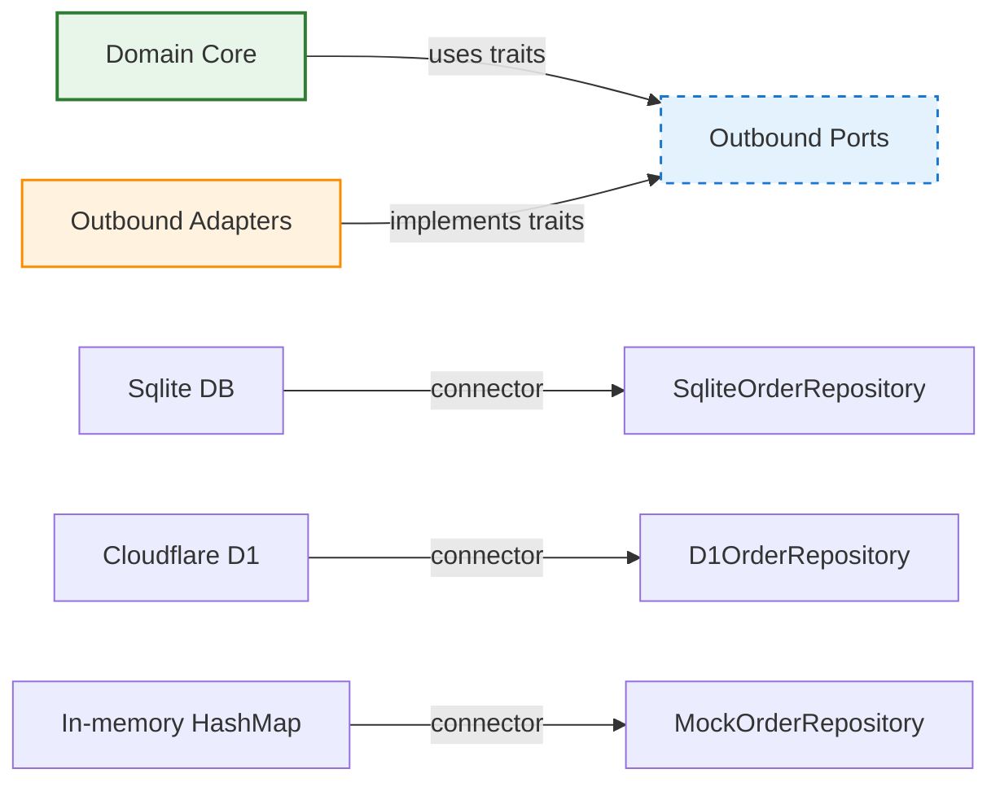

# 06_domain-modeling-patterns.md - Domain-Driven Design Patterns for PlinthOS

**Author**: PlinthOS Documentation Team  
**Version**: 0.1.0  
**Last Reviewed**: 2026-08-28  
**Related Files**: 
- `04_hexagonal-architecture.md` (structural pattern these models fit into)
- `05_bounded-contexts.md` (these models belong to specific contexts)
- `07_rust-safety-mandates.md` (safety rules that govern modeling decisions)
- `08_typescript-standards.md` (TypeScript equivalents of these patterns)
- `AGENTS.md` (project conventions including financial precision mandates)
- `DEVELOPER-NAVIGATION.md` (master navigation)

---

## 6.1 Core DDD Pattern Overview

PlinthOS implements Domain-Driven Design (DDD) through the hexagonal architecture documented in `04_hexagonal-architecture.md`. The core pattern consists of **Aggregates**, **Value Objects**, **Domain Events**, and **Repository Traits**. All of this lives in `packages/core-domain` with **zero infrastructure dependencies**.

### 6.1.1 The Aggregate Root Pattern

**Definition**: An Aggregate Root is the entry point to an Aggregate. It enforces invariants and coordinates changes to child entities and value objects. No other aggregate root references aggregate children directly - they always go through the root.

**PlinthOS Pattern** (per `packages/core-domain/src/models/`):

```rust
// Example: Order aggregate root
pub struct Order {
    pub id: OrderId,
    pub tenant_id: TenantId,
    pub location_id: LocationId,
    pub status: OrderStatus,
    pub items: Vec<OrderLineItem>,
    pub discounts: Vec<Discount>,
    pub charges: Vec<OrderCharge>,
    pub tip: Option<TipAmount>,
    pub payments: Vec<PaymentEntry>,
    pub created_at: DateTime<Utc>,
    pub updated_at: DateTime<Utc>,
    pub deleted_at: Option<DateTime<Utc>>,
}

// Invariant enforcement is done via methods, not direct field mutation
impl Order {
    /// Creates a new draft order - emits Domain Event
    pub fn new(...) -> (Self, OrderEvent) { ... }
    
    /// Adds item - validates invariants, emits event
    pub fn add_item(&mut self, item: OrderLineItem) -> Result<OrderEvent, OrderError> { ... }
    
    /// Removes item - validates invariants, emits event
    pub fn remove_item(&mut self, line_item_id: OrderLineItemId) -> Result<OrderEvent, OrderError> { ... }
    
    /// Changes quantity - validates seat balance invariant
    pub fn change_quantity(&mut self, line_item_id: OrderLineItemId, new_quantity: u32) -> Result<OrderEvent, OrderError> { ... }
    
    /// Validates invariants before state transition
    fn validate_settlement(&self, applicability: &GstApplicability) -> Result<(), OrderError> { ... }
}
```

**Key Principles**:
1. **Mutate only through methods** - Never mutate aggregate fields directly
2. **Domain Events emitted on every state change** - Every mutation triggers an event
3. **Invariants validated within methods** - Seat balance, payment sufficiency, status transitions
4. **Entity Identity is separate from Domain Identity** - `OrderId` is a UUID; logical identity is the `status` field

### 6.1.2 Value Objects (The "Money" Pattern)

**Definition**: Value Objects have no conceptual identity - two value objects are equal if all their attributes are equal. They're immutable and typically used for financial/quantitative concepts.

**PlinthOS Mandate** (per `AGENTS.md` and enforced throughout `core-domain`):

> **Financial Precision**: All monetary/financial calculations MUST use `rust_decimal::Decimal` (IEEE-754 floating point arithmetic is strictly prohibited).

**Value Object Patterns** in `core-domain`:

#### 6.2.1 Money (`packages/core-domain/src/value_objects/money.rs`)

```rust
use rust_decimal::Decimal;
use crate::value_objects::enums::currency::Currency;

#[derive(Debug, Clone, PartialEq, Eq, Serialize, Deserialize, specta::Type)]
pub struct Money {
    pub amount: Decimal,    // Fixed precision, no floating point
    pub currency: Currency, // ISO 4217 or custom enum
}

impl Money {
    /// Create Money from minor units (cents) - avoids float entirely
    pub fn from_minor_units(amount: i64, currency: Currency) -> Self {
        Money {
            amount: Decimal::from(amount),
            currency,
        }
    }
    
    /// Add two Money values (financially precise)
    pub fn add(&self, other: &Self) -> Result<Self, MoneyError> {
        if self.currency != other.currency {
            return Err(MoneyError::CurrencyMismatch);
        }
        Ok(Money {
            amount: self.amount + other.amount,
            currency: self.currency,
        })
    }
    
    /// Multiply Money by quantity (e.g., 3 x $4.50 = $13.50)
    pub fn mul_quantity(&self, quantity: u32) -> Self {
        Money {
            amount: self.amount * Decimal::from(quantity),
            currency: self.currency,
        }
    }
    
    /// Zero money for currency
    pub fn zero(currency: Currency) -> Self {
        Money {
            amount: Decimal::ZERO,
            currency,
        }
    }
    
    /// Check if positive (used for validation)
    pub fn is_positive(&self) -> bool {
        self.amount > Decimal::ZERO
    }
}
```

**Usage Across Contexts**:
- **Ordering**: Line item prices, totals, discounts, taxes all use `Money`
- **Inventory**: Stock valuation, reorder thresholds use `Money`
- **Billing**: Revenue totals, Z-report amounts use `Money`
- **Never** use `f64` or `f32` for monetary values in the codebase

#### 6.2.2 GstRate (`packages/core-domain/src/value_objects/tax.rs`)

```rust
#[derive(Debug, Clone, PartialEq, Eq, Serialize, Deserialize, specta::Type)]
pub enum GstRate {
    Zero,    // 0% GST
    Five,    // 5% GST
    Ten,     // 10% GST
    Fifteen, // 15% GST
}

impl GstRate {
    /// Convert to human string
    pub fn description(&self) -> &'static str {
        match self {
            GstRate::Zero => "0% GST",
            GstRate::Five => "5% GST",
            GstRate::Ten => "10% GST",
            GstRate::Fifteen => "15% GST",
        }
    }
    
    /// Apply rate to money amount (returns tax + total)
    pub fn apply(&self, amount: &Money) -> TaxBreakdown {
        // Uses Decimal arithmetic internally, never f64
        let taxable = amount.amount.clone();
        let tax_rate: Decimal = match self {
            GstRate::Zero => Decimal::ZERO,
            GstRate::Five => Decimal::from(5) / Decimal::from(100),
            GstRate::Ten => Decimal::from(10) / Decimal::from(100),
            GstRate::Fifteen => Decimal::from(15) / Decimal::from(100),
        };
        
        let tax = taxable * tax_rate;
        let total = taxable + tax;
        
        TaxBreakdown {
            total_tax: Money::from_minor_units(
                (tax * Decimal::from(100)).round() as i64, // scaled back
                amount.currency,
            ),
            components: vec![TaxComponent {
                rate: self.clone(),
                amount: amount.clone(),
            }],
        }
    }
}
```

#### 6.2.3 GstApplicability (`packages/core-domain/src/value_objects/tax.rs` - same file)

```rust
#[derive(Debug, Clone, PartialEq, Eq, Serialize, Deserialize, specta::Type)]
pub enum GstApplicability {
    /// GST applies to this line item
    Applicable,
    /// GST does not apply (exempt items)
    Exempt,
    /// Reverse charge mechanism (business GST)
    ReverseCharge,
    /// Out of scope (export, international)
    OutOfScope,
}

impl GstApplicability {
    /// Check if GST should be computed for this item/context
    pub fn should_compute_gst(&self) -> bool {
        matches!(self, GstApplicability::Applicable)
    }
}
```

### 6.1.3 Domain Events Pattern

**Definition**: Domain Events represent something that happened in the domain. They're immutable, serializable, and can be persisted for audit/reconstruction. Events are emitted by Aggregate Roots and handled by other contexts via event subscription.

**PlinthOS Pattern** (per `packages/core-domain/src/events/`):

```rust
// Example: Order events - all are plain structs, no enum exhaustiveness required
// but typically grouped into a enum or trait for pattern matching

#[derive(Debug, Clone, PartialEq, Serialize, Deserialize, specta::Type)]
pub enum OrderEvent {
    /// Order was initially created
    Created {
        order_id: OrderId,
        tenant_id: TenantId,
        location_id: LocationId,
        terminal_id: TerminalId,
        channel: OrderChannel,
        created_by: StaffMemberId,
        created_at: DateTime<Utc>,
    },
    
    /// A line item was added to the order
    ItemAdded {
        order_id: OrderId,
        line_item_id: OrderLineItemId,
        menu_item_id: MenuItemId,
        item_name: String,
        quantity: u32,
        unit_price_minor: i64,      // in cents/sub-units
        modifier_total_minor: i64,
        added_at: DateTime<Utc>,
    },
    
    /// A line item was removed from the order
    ItemRemoved {
        order_id: OrderId,
        line_item_id: OrderLineItemId,
        reason: Option<String>,
        removed_at: DateTime<Utc>,
    },
    
    /// Item quantity was changed
    ItemQuantityChanged {
        order_id: OrderId,
        line_item_id: OrderLineItemId,
        old_quantity: u32,
        new_quantity: u32,
        changed_at: DateTime<Utc>,
    },
    
    /// Discount was applied to order
    DiscountApplied {
        order_id: OrderId,
        discount_percentage: Option<String>,  // Some("20.0") or None
        discount_flat_minor: Option<i64>,     // Some(500) = $5.00 flat, or None
        reason: String,                       // e.g., "LOYALTY20"
        authorized_by: StaffMemberId,
        applied_at: DateTime<Utc>,
    },
    
    /// Order was settled (payment verified, sufficient funds)
    OrderSettled {
        order_id: OrderId,
        total_minor: i64,     // grand total in minor units
        settled_at: DateTime<Utc>,
    },
    
    /// Order was voided by supervisor
    OrderVoided {
        order_id: OrderId,
        reason: String,
        voided_by: StaffMemberId,
        requires_supervisor: bool,
        voided_at: DateTime<Utc>,
    },
    
    /// Order was split into two checks
    BillSplit {
        parent_order_id: OrderId,
        child_order_ids: Vec<OrderId>,
        split_at: DateTime<Utc>,
    },
}

// All events implement these traits:
pub trait DomainEvent: Serialize + for<'de> Deserialize<'de> + Send + Sync + 'static {
    fn aggregate_id(&self) -> &OrderId;  // Which aggregate emitted this
    fn occurred_at(&self) -> &DateTime<Utc>;  // When it happened
}
```

**Event Handling Across Contexts** (one-way, per `05_bounded-contexts.md`):

```rust
// Ordering context emits when order settles
OrderEvent::OrderSettled { order_id, total_minor } => {
    EventBus::publish("order_settled", order_id, total_minor);
}

// KDS context subscribes (fire-and-forget, doesn't block order processing)
EventBus::on("order_settled", |order| {
    // Create KDS tickets for this order
    kds_create_tickets(order.items);
});

// Inventory context subscribes (automatic stock deduction)
EventBus::on("order_settled", |order| {
    // Deduct stock based on items
    inventory_deduct_from_recipe(order.items);
});
```

### 6.1.4 Repository Trait Pattern

**Definition**: The Repository pattern mediates between the domain and data mapping layers. It emulates a collection of aggregates, isolating the rest of the application from details of database access implementation.

**Per `04_hexagonal-architecture.md`**, every aggregate root has a corresponding trait:

```rust
#[async_trait::async_trait]
pub trait OrderRepository: Send + Sync {
    async fn find_by_id(&self, id: OrderId) -> Result<Order, DbError>;
    async fn find_by_tenant_and_status(
        &self,
        tenant_id: TenantId,
        status: OrderStatus,
    ) -> Result<Vec<Order>, DbError>;
    async fn save(&self, order: &Order) -> Result<(), DbError>;
    async fn soft_delete(&self, order_id: OrderId) -> Result<(), DbError>;
    async fn count_by_tenant(&self, tenant_id: TenantId) -> Result<u64, DbError>;
}
```

**Implementations**:
- `SqliteOrderRepository` - `apps/edge-api/src/db/mod.rs` uses `rusqlite`
- `D1OrderRepository` - Cloudflare D1 via `worker-rs`
- `MockOrderRepository` - In-memory HashMap for testing

---

## 6.2 Context-Specific Modeling Patterns

### 6.2.1 Ordering Context Models

**Aggregate**: `Order` (`packages/core-domain/src/models/order.rs`)

**Value Objects** (within Ordering context):
- `OrderLineItem` - Line item with price, modifiers, tax rate
- `Discount` - Percentage or flat amount discount
- `OrderCharge` - Surcharge/fee (delivery, packaging, etc.)
- `TipAmount` - Gratuity added by customer
- `PaymentEntry` - Individual payment transaction
- `SeatNumber` - Dining table seat assignment

**Domain Events** (emitted by Order aggregate):
- `OrderCreated`
- `ItemAdded`, `ItemQuantityChanged`, `ItemRemoved`
- `DiscountApplied`, `DiscountRemoved`
- `ChargeAdded`
- `PaymentRecorded`
- `TipAdded`
- `OrderSettled`
- `OrderVoided`
- `BillSplit`

**Key Invariants** (enforced in aggregate methods):
1. **Seat Balance**: $\sum \text{(Seat Check Totals)} = \text{Order Total}$
2. **Financial Precision**: All Money values use `rust_decimal::Decimal`
3. **Status Transition Order**: Draft → Submitted → InPrep → Ready → Bumped → Settled (can't skip)
4. **Payment Sufficiency**: Can't settle if paid < grand total
5. **Discount Validity**: Percentage must be 0-100%; flat amount can't exceed subtotal

**Related Code**:
- `packages/core-domain/src/models/order.rs` - Full Order implementation (600+ lines)
- `packages/core-domain/src/events/order.rs` - Order event definitions
- `packages/core-domain/src/enums/order_status.rs` - Status enum with transition validation
- `packages/core-domain/src/enums/order_channel.rs` - DineIn, Takeout, Delivery, Kiosk

### 6.2.2 Kitchen Execution Context Models

**Aggregate**: `KitchenTicket` (`packages/core-domain/src/models/kitchen.rs`)

**Value Objects** (within KDS context):
- `TicketLine` - Individual item line on kitchen display
- `StationId` - Identifier for kitchen station (GRILL_01, SALAD_01, etc.)
- `CourseStage` - APPETIZER, MAIN, DESSERT, DRINKS
- `PreparationSLA` - Timer thresholds (Green <8m, Yellow 8-12m, Red >15m)
- `PreparationInstruction` - Special notes (no onions, well-done, etc.)

**Domain Events** (emitted by KitchenTicket):
- `TicketCreated` - When order items routed to KDS
- `TicketLineAdded` - Item line added to ticket
- `LineStatusChanged` - PENDING → IN_PREP → READY → BUMPED
- `CourseStageUpdated` - Current course stage
- `SLAStatusChanged` - Green → Yellow → Red
- `TicketBumped` - Server marks item served
- `TicketCancelled` - Void/manager override

**Key Invariants**:
1. **State Machine Order**: Can't bypass PENDING → IN_PREP → READY → BUMPED
2. **SLA Timer**: Starts when ticket enters PENDING; thresholds enforced visually on KDS
3. **Station Balance**: System attempts to distribute lines evenly across stations
4. **Fast-Track Authorization**: Only roles with `Permissions::FAST_TRACK` can bypass state machine

**Related Code**:
- `packages/core-domain/src/models/kitchen.rs` - KitchenTicket aggregate
- `packages/core-domain/src/models/ticket_line.rs` - TicketLine entity
- `packages/core-domain/src/events/kitchen.rs` - Kitchen event definitions
- `apps/edge-api/routes/kds.rs` - KDS API + WebSocket routes
- `apps/pos-client/src/showcase/ShowcaseView.tsx` - KDS demo UI

### 6.2.3 Inventory Context Models

**Aggregate**: `StockItem` (`packages/core-domain/src/models/stock.rs`)

**Value Objects** (within Inventory context):
- `Recipe` - Maps menu items to required stock items + quantities
- `UnitQty` - Unit of measure with conversion factors
- `StockDelta` - Change in stock (positive = receipt, negative = deduction)
- `ReorderPoint` - Minimum threshold that triggers alert
- `MaximumStock` - Optimal ceiling
- `Wastage` - Separate tracking from normal deduction

**Domain Events** (emitted by StockItem):
- `StockAdjusted` - Manual or automatic quantity change
- `StockReorderAlert` - Stock below reorder point
- `RecipeDeducted` - Automatic deduction when ORDER_SUBMITTED event received
- `WastageRecorded` - Spoilage/error trim
- `StockCountPerformed` - Physical inventory count
- `MinimumStockMet` - Stock restocked above reorder point

**Key Invariants**:
1. **Automatic Deduction**: When `ORDER_SUBMITTED` event received → `RecipeDeducted` emitted → stock levels updated
2. **Unit Conversion Consistency**: `UnitQty` conversions validated on recipe creation
3. **Wastage vs Normal**: Wastage events tracked separately for audit; doesn't count against reorder thresholds (or has different thresholds)
4. **Negative Stock Allowed In-Flight**: If order being prepared has items, stock can go slightly negative; reconciled when order settled

**Related Code**:
- `packages/core-domain/src/models/stock.rs` - StockItem aggregate
- `packages/core-domain/src/models/recipe.rs` - Recipe entity with item mappings
- `packages/core-domain/src/value_objects/measurement.rs` - UnitQty conversions
- `packages/sync-protocol/` - CRDT-based offline sync for stock counts across locations
- `apps/edge-api/routes/inventory.rs` - Inventory API endpoints

### 6.2.4 Tenant Billing Context Models

**Aggregate**: `StoreShift` (`packages/core-domain/src/models/store_shift.rs`)

**Value Objects** (within Billing context):
- `ZReport` - End-of-shift reconciliation summary
- `TaxLiability` - Computed GST totals for reporting period
- `TenderBreakdown` - Payment method distribution (cash %, card %, UPI %)
- `ZVariance` - Discrepancy between expected and actual
- `StaffRole` - Cashier/Manager/Supervisor/Admin (enum with permission bitmask)
- `ShiftFloat` - Opening till float amount

**Domain Events** (emitted by StoreShift):
- `ShiftOpened` - Till start, float verification
- `ShiftClosed` - Z-report generation, final count
- `ZReportGenerated` - Revenue summary, tender breakdown, tax totals
- `PaymentSettlement` - Payment recorded against shift
- `StaffRoleChanged` - Permission bitmask update
- `SupervisorOverride` - Used for voids, overrides normal invariant checks

**Key Invariants**:
1. **Shift Close Precondition**: Active open checks must be settled before Z-report can generate
2. **Tenant Isolation**: Every query mandatorily binds `tenant_id` and `location_id`
3. **Permission Bitmask**: `Permissions` enum from `core-domain::enums::staff`; `@typescript-eslint/no-explicit-any: error` in TS
4. **ZReport Immutability**: Once generated, never overwrite (soft-delete pattern with versioning)
5. **Tax Calculation**: Use `compute_gst()` from `core-domain` value_objects; no manual tax calc

**Related Code**:
- `packages/core-domain/src/models/store_shift.rs` - StoreShift aggregate
- `packages/core-domain/src/models/z_report.rs` - ZReport entity
- `packages/core-domain/src/value_objects/tax.rs` - `compute_gst()` function
- `packages/core-domain/src/value_objects/tender_breakdown.rs` - Tender distribution
- `apps/web-dashboard/src/app/` - Dashboard shift management UI
- `apps/edge-api/routes/reports.rs` - Reports API (sales analytics)

---

## 6.3 TypeScript Equivalents (per AGENTS.md Standards)

Per `AGENTS.md` Section 4B (TypeScript Quality Standards):

> **Strict Typing**: TypeScript `strict` mode (`strict: true`, `noImplicitAny: true`) is enforced across all JS/TS projects.
> **No Explicit Any**: Using `any` type is strictly forbidden.
> **Framework Choice**: Apps use React + TypeScript + Vite (target Cloudflare Pages / Workers)

**TypeScript Domain Patterns** (in `apps/` directories):

### 6.3.1 TypeScript Interfaces (vs Rust Structs)

```tsx
// Rust (core-domain)
pub struct Money {
    pub amount: Decimal,
    pub currency: Currency,
}

// TypeScript (apps/web-dashboard)
export interface Money {
  amount: number;        // Stored as minor units (cents) internally
  currency: 'INR' | 'USD' | 'AUD' | ...; // Enum, not string
}
```

**Key TS Patterns** (per `apps/web-dashboard/package.json` and `tsconfig.json`):

```tsx
// NO `any` allowed - ESLint @typescript-eslint/no-explicit-any: error
// All types must be explicit

// Good: Explicit enum
enum PaymentMethod { Cash, Card, UPI, Wallet }

// Good: Interface with required fields
interface OrderLineItem {
  id: string;
  menuItemId: string;
  name: string;
  quantity: number;
  priceCents: number;  // Stored as cents, converted to Decimal for calcs
}

// Good: Union types for states
type OrderStatus = 'DRAFT' | 'SUBMITTED' | 'IN_PREP' | 'READY' | 'BUMPED' | 'SETTLED';

// Good: Type guards for runtime checks
function isOrderSettled(status: OrderStatus): status is 'SETTLED' {
  return status === 'SETTLED';
}
```

### 6.3.2 TypeScript Value Object Equivalents

```tsx
// Rust: Money struct with Decimal
// TypeScript: Money calculated function (per core-domain validate_amount, calculate_tax)

export function calculateTax(
  amountStr: string, 
  taxRateStr: string
): Result<String, JsValue> {
  // Uses rust_decimal-inspired precision via string-based Decimal
  // Or a TS Decimal library equivalent
}

// In practice, TS frontend sends amounts as integers (cents) to avoid float loss
// conversion happens in Rust backend (edge-api)
```

### 6.3.3 TypeScript Enum Patterns (per `AGENTS.md`)

```tsx
// Good: Explicit enum with bits for permission mask
enum Permissions {
  TAKE_ORDER = 1 << 0,    // 0001
  MANAGE_MENU = 1 << 1,   // 0010
  VOID_ORDERS = 1 << 2,   // 0100
  FAST_TRACK = 1 << 3,    // 1000
  // Bitmask operations:
  // Permissions.TAKE_ORDER | Permissions.MANAGE_MENU
}

// Usage in React component
const canManageMenu = (permissions: Permissions) =>
  (permissions & Permissions.MANAGE_MENU) === Permissions.MANAGE_MENU;
```

---

## 6.4 Modeling Best Practices (PlinthOS Conventions)

### 6.4.1 What Belongs in Which Context - Decision Matrix

| Feature Idea | Likely Context | Why |
|---|---|---|
| "Calculate order total with tax" | Ordering | Money calc, GST rate, applicability |
| "Reduce stock when order placed" | Inventory | Recipe deduction, stock level update |
| "Change ticket status to BUMPED" | KDS | State machine invariant, SLA timer |
| "Generate Z-report for shift" | Billing | Shift close precondition, tax liability |
| "Customer taps '86' on menu item" | Ordering | Item availability, emits event for KDS + Inventory |
| "User forgets password" | Billing (or separate Auth) | JWT verification, tenant isolation |

**Decision Rule**: When in doubt, default to Ordering context and emit domain events for other contexts to react to. Importing across context boundaries is discouraged.

### 6.4.2 Invariant Enforcement Location

| Invariant Type | Where Enforced |
|---|---|
| Business rule (e.g., "can't settle without payment") | Aggregate root method (Rust) / Redux reducer (TS) |
| Database constraint (e.g., "tenant_id required") | Repository adapter SQL (`WHERE tenant_id = ?`) |
| Type safety (e.g., "no `any` in TS") | ESLint + `strict: true` + compiler |
| Financial precision (e.g., "use Decimal") | Clippy lints + `#![deny(unsafe_code)]` + code review |

### 6.4.3 Event Naming Conventions

All domain events follow pattern: `Verb + Noun` (past tense, describing something that happened)

| Correct | Incorrect |
|---|---|
| `OrderCreated` | `OrderCreate` |
| `ItemAdded` | `ItemAdd` |
| `OrderSettled` | `OrderSettle` |
| `DiscountApplied` | `DiscountApply` |
| `StockReorderAlert` | `LowStock` (too vague) |

**Pattern**: `ALL_CAPS` for enum variants, PascalCase for struct fields carrying event data.

### 6.4.4 Versioning Domain Events

Events are versioned for forward/backward compatibility:

```rust
// Event with version field
#[derive(Debug, Clone, PartialEq, Serialize, Deserialize, specta::Type)]
pub enum OrderEvent {
    #[specta(version = "1.0")]
    Created { ... },
    
    #[specta(version = "2.0")]  // New field added, old fields still present
    ItemAdded { 
        ...,
        new_field: Option<String>,  // Optional, backward-compatible
    },
}
```

**Consumers** check `event.version` before pattern-matching; unknown fields default to `None`/zero.

---

## 6.5 Diagrams Summary

### Aggregate Root Pattern

```mermaid
stateDiagram-v2
    [*] --> OrderCreated: Order::new()
    
    state OrderAggregate {
        [*] --> Draft: Initial state
        Draft --> ItemAdded: add_item()
        ItemAdded --> QuantityChanged: change_quantity()
        QuantityChanged --> ItemRemoved: remove_item()
        ItemRemoved --> DiscountApplied: apply_discount()
        DiscountApplied --> TipAdded: add_tip()
        TipAdded --> OrderSettled: settle()
        OrderSettled --> Voided: void_order()
        
        note right of OrderSettled: Emits OrderSettled event
        note right of Voided: Emits OrderVoided event
    }
    
    OrderCreated --> KDS: EventBus.publish()
    OrderSettled --> Inventory: EventBus.publish()
    OrderSettled --> Billing: EventBus.publish()
```

### Value Object Pattern (Money)

```mermaid
graph LR
    A[Money::from_minor_units(1250, INR)] --> B[Money::add(Money::from_minor_units(500, INR))]
    B --> C[Money::mul_quantity(3)]  -- 3 x $12.50 = $37.50 --> D
    D --> E[Money::is_positive()]   -- true/false validation
    F[Money::zero(INR)] --> G[Financial comparison]
    
    style Money fill:#e8f5e9,stroke:#2e7d32,stroke-width:2px
```

### Domain Event Flow

```mermaid
sequenceDiagram
    participant OrderAgg as Order Aggregate Root
    participant EventBus as Event Bus / Message Queue
    participant KDS as Kitchen Context
    participant Inv as Inventory Context
    participant Bill as Billing Context
    
    OrderAgg->>EventBus: publish(OrderSettled {order_id, total})
    EventBus->>KDS: subscribe("order_settled") → create_tickets
    EventBus->>Inv: subscribe("order_settled") → deduct_stock
    EventBus->>Bill: subscribe("order_settled") → update_revenue
    
    Note across right: Fire-and-forget; OrderAgg unaffected by receivers
```

### Repository Pattern



---

## 6.5 Next Steps After Understanding Domain Modeling

After reading this file, proceed with:

1. **Read** `07_rust-safety-mandates.md` to understand the non-negotiable rules that govern all modeling decisions
2. **Read** `08_typescript-standards.md` to see how these patterns translate to the React/TS frontend
3. **Explore** `packages/core-domain/src/` directory:
   - `lib.rs` - Root with `#![deny(unsafe_code)]`
   - `models/order.rs` - Full Order aggregate
   - `models/kitchen.rs` - KitchenTicket aggregate
   - `models/stock.rs` - StockItem aggregate
   - `models/store_shift.rs` - StoreShift aggregate
   - `events/mod.rs` - Event definitions and Bus
   - `ports.rs` - Repository traits
   - `value_objects/mod.rs` - Money, Tax, Discount, etc.
4. **Look at** an aggregate implementation: `packages/core-domain/src/models/order.rs` - notice how `add_item()` validates invariants and emits events
5. **Try** writing a new domain event: Add a new variant to `OrderEvent` and ensure it's emitted in the right place
6. **Run** `cargo test --workspace` and notice how domain tests use `MockOrderRepository` (no DB needed)

---

## 6.6 Version & Change Log

| Version | Date | Author | Changes |
|---|---|---|---|
| 0.1.0 | 2026-08-28 | Docs Team | Initial release - DDD patterns overview |
| 0.1.1 | YYYY-MM-DD | TBD | Updates based on contributor feedback |
| 0.2.0 | YYYY-MM-DD | TBD | Major overhaul for new domain patterns |

---
*This file is part of the PlinthOS internal developer documentation set. See `05_bounded-contexts.md` for context mappings, `04_hexagonal-architecture.md` for the structural pattern, and `packages/core-domain/src/` for the actual code implementations.*