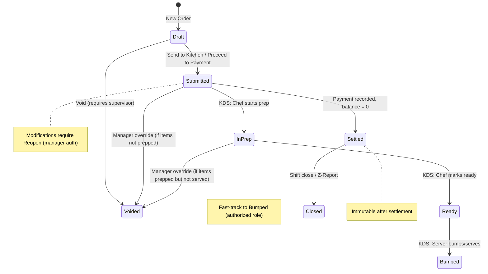

# 22_order-taking-workflow.md - Complete Order Taking Workflow

**Author**: PlinthOS Documentation Team  
**Version**: 0.1.0  
**Last Reviewed**: 2026-08-28  
**Related Files**: 
- `21_pos-quick-start.md` (prerequisite - basic POS setup)
- `23-payment-processing.md` (payment processing after order)
- `24-split-bill-and-merging.md` (split/merge operations)
- `25-kds-kitchen-interaction.md` (KDS integration)
- `33-troubleshooting-guide.md` (issue resolution)

---

## 22.1 Order Channel Types

PlinthOS supports four order channels. The channel affects workflow, kitchen routing, and reporting.

| Channel | Description | Typical Use Case | KDS Routing |
|---|---|---|---|
| **DineIn** | Table service, server takes order | Full-service restaurant | Normal course staging |
| **Takeout** | Customer picks up | Counter service, quick service | Express prep (no course staging) |
| **Delivery** | Driver delivers | Third-party or in-house delivery | Timed prep for driver ETA |
| **Kiosk** | Self-ordering terminal | Fast casual, QSR | Direct to KDS, no server |

**Selecting channel**: At order start, the POS prompts for channel type. Select the appropriate one based on customer interaction.

---

## 22.2 Item Selection and Modifiers

### 22.2.1 Menu Navigation

The POS menu is organized by **categories** (configured in the dashboard):

```
Categories (horizontal tabs at top):
[Appetizers] [Main Courses] [Drinks] [Desserts] [Specials] [86'd Items]
```

### 22.2.2 Adding Items

**Method A: Quick Tap (Quantity = 1)**
1. Navigate to the correct category tab
2. Tap the item button once → adds 1 quantity
3. Item appears in order preview with running total

**Method B: Quantity Entry (Custom Quantity)**
1. Using the numeric keypad, enter the desired quantity (e.g., "3")
2. Tap the item button → adds 3 quantities
3. All 3 appear as a single line item in order preview

**Method C: Search/Filter**
1. Tap the search icon (magnifying glass) in menu area
2. Type item name (e.g., "butter chicken")
3. Results filter in real-time
4. Tap result to add to order

### 22.2.3 Modifier Selection

**When an item has modifiers configured** (e.g., "Medium Spicy", "No Onions", "Extra Cheese"):

1. **Tap the item** in the menu grid
2. **Modifier selection screen opens** showing:
   - **Modifier Group 1**: Spice Level (Required: Single Select)
     - Mild (+$0)
     - Medium (+$0.50)
     - Spicy (+$1.00)
   - **Modifier Group 2**: Allergens/Removals (Optional: Multi-Select)
     - No Onions (+$0)
     - No Garlic (+$0)
   - **Modifier Group 3**: Extras (Optional: Multi-Select)
     - Extra Cheese (+$1.50)
     - Extra Meat (+$3.00)
3. **Select desired modifiers** by tapping
   - Required groups: Must select at least one
   - Optional groups: Can select multiple or none
   - Price deltas shown for each modifier
5. **Tap "Add to Order"** (or "Done")
6. **Item appears** in order preview with base price + modifier total

**Modifier rules** (configured in dashboard):
- **Single Select**: Only one choice from group (radio button style)
- **Multi Select**: Multiple choices allowed (checkbox style)
- **Required**: Must make a selection before adding to order
- **Optional**: Can skip the modifier group
- **Price Delta**: Can be positive (upcharge), zero (included), or negative (discount)

### 22.2.4 Special Preparation Notes

**For custom requests not covered by modifiers**:

1. **After adding item to order**, tap the item in the order preview
2. **Select "Add Note"** or "Special Instructions"
3. **Type or select from common notes**:
   - "Allergy: Peanuts"
   - "Well Done"
   - "Sauce on Side"
   - "No Salt"
   - "Vegetarian"
   - "Gluten Free"
4. **Note appears** under the item in order preview and prints on KOT (Kitchen Order Ticket)

---

## 22.3 Table and Seat Assignment

### 22.3.1 Dine-In Table Assignment

**For DineIn channel orders**, assign a table before or during order taking:

1. **Before starting order**: Tap "Select Table" in top bar
2. **Floor plan view** opens showing all tables for this location
3. **Tap the occupied table** (color-coded: Green = empty, Blue = occupied, Red = needs attention)
4. **Table number** appears in top bar (e.g., "Table 12")
5. **Add items** to the order - they're associated with Table 12

### 22.3.2 Seat Number Assignment

**For seat-level tracking** (family-style, shared dishes, split bills):

1. **After table assignment**, the order preview shows seat numbers for each item
2. **Tap an item** in the order preview
3. **Select "Assign Seat"**
4. **Choose seat number** (1-8 typically, configurable per table size)
5. **Repeat for other items** as needed
6. **Seat check totals** calculate automatically (for split billing)

**Why seat assignment matters**:
- **Seat check total** = sum of items assigned to that seat
- **Order total** = sum of all seat check totals (invariant enforced)
- **Split bill by seat** = one click to create separate checks per seat

### 22.3.3 Table Management

| Action | How To |
|---|---|
| **Change table** | Tap table number in top bar → select new table |
| **Merge tables** | (Manager only) Long-press two tables → "Merge" |
| **Close table** | All items settled → tap "Close Table" → table returns to green |
| **View table details** | Tap table in floor plan → shows all open checks, items, time |

---

## 22.4 Order Pausing and Resuming

### 22.4.1 Pausing an Order

**Scenario**: Customer needs more time, you're interrupted, or switching tables.

1. **In the active order**, tap **"Pause Order"** (or "Hold")
2. **The order saves** as a draft with all items, modifiers, notes intact
3. **Order disappears** from active view but remains in "Paused Orders" list
4. **New Order** can be started immediately
5. **Paused order status**: `OrderStatus::Draft` (in domain model)

### 22.4.2 Resuming a Paused Order

1. **Tap "Paused Orders"** in top navigation or side menu
2. **List of paused orders** shows:
   - Table/Seat
   - Item count
   - Time paused
   - Running total
3. **Tap the order to resume** - loads back into active order view
4. **Continue** adding items, modifying, or proceed to payment

### 22.4.3 Managing Multiple Active Orders

**For servers handling multiple tables simultaneously**:

1. **Start order for Table 5** → add items → pause
2. **Start order for Table 12** → add items → pause
3. **Switch between** using "Active Orders" or "Paused Orders" list
4. **Each order maintains** its own table, items, and state independently
5. **Settle individually** when each table is ready to pay

---

## 22.5 Discounts, Surcharges, and Charges

### 22.5.1 Applying Discounts

**Scenario**: Customer has a loyalty discount or manager applies a promo.

1. **In the active order**, tap **"Apply Discount"**
2. **Select discount type**:
   - **Percentage** (e.g., 10%, 15%, 20%)
   - **Flat Amount** (e.g., $5.00 off, $10.00 off)
   - **Pre-configured Promo** (e.g., "LUNCH20", "HAPPYHOUR")
3. **Enter authorization** if required:
   - Manager password/JWT for manual discounts
   - Promo code validation for pre-configured
4. **Discount applies** to subtotal (before tax)
5. **Running total updates** immediately

**Discount validation** (per domain model):
- Percentage: 0-100% only
- Flat amount: Cannot exceed subtotal
- Only one discount per order (or per configuration)

### 22.5.2 Adding Surcharges/Charges

**Scenario**: Delivery fee, packaging charge, service charge.

1. **In the active order**, tap **"Add Charge"**
2. **Select charge type**:
   - Delivery Fee (pre-configured amount)
   - Packaging Charge (per container)
   - Service Charge (percentage or flat)
   - Custom Charge (enter amount + description)
3. **Charge appears** in order preview as separate line
4. **Taxable?** Some charges are taxable, some not (configurable)
5. **Running total** includes charge + applicable tax

### 22.5.3 Removing Discounts/Charges

1. **In the active order**, tap the discount or charge line in the preview
2. **Select "Remove"** or "Cancel"
3. **Running total recalculates** instantly
4. **Audit trail** records the removal (who, when, why)

---

## 22.6 Splitting and Merging Bills

See `24-split-bill-and-merging.md` for detailed workflow.

**Quick Summary**:
- **Split by Seat**: Auto-creates separate checks per seat assignment
- **Split by Item**: Manually move specific items to new check
- **Merge Orders**: Combine two open checks from same table into one
- **Transfer Items**: Move specific items between checks/tables

---

## 22.7 Order Submission to Kitchen

### 22.7.1 Automatic Submission

**Default behavior**: When you tap "Send to Kitchen" or proceed to payment:
1. Order status changes from `Draft` → `Submitted`
2. Domain event `OrderEvent::OrderSubmitted` emitted
3. Kitchen context receives event → creates `KitchenTicket`
4. KDS displays new ticket with `PENDING` status
5. Inventory context receives event → deducts stock via recipes
6. Order becomes **read-only** for modifications (requires "Reopen" with manager auth)

### 22.7.2 Item Firing (Partial Kitchen Send)

**For complex orders** where some items ready before others:

1. **In order preview**, each line item has "Fire" button
2. **Tap "Fire" on specific items** → marks `fired_quantity` = quantity for that item
3. **Only fired items** go to KDS in this round
4. **Remaining items** stay in order with `fired_quantity = 0`
5. **Later**: Tap "Fire" on remaining items as courses progress
6. **KDS receives** items in waves matching course stages

### 22.7.3 Reopening a Submitted Order

**Scenario**: Customer wants to add item after order sent to kitchen.

1. **Requires manager/supervisor authorization** (configured)
2. **In submitted order**, tap **"Reopen Order"**
3. **Supervisor enters credentials** (JWT/password)
4. **Order status reverts** to `Draft`
5. **Modifications allowed** again
6. **Re-submit** when complete (sends new items to KDS)

---

## 22.8 Quick Reference: Order State Transitions



---

## 22.9 Troubleshooting Order Taking

| Issue | Resolution |
|---|---|
| "Item not in menu" | Check if 86'd, or wrong category; verify dashboard menu config |
| "Modifier required" | Must select at least one from required group; contact manager if unavailable |
| "Cannot add item" | Order may be submitted (needs reopen); or 86'd item |
| "Seat total mismatch" | Recalculate seat assignments; invariant: Σ seat totals = order total |
| "Discount rejected" | Flat amount exceeds subtotal, or percentage >100%; check config |
| "Charge not taxable" | Verify charge configuration in dashboard (taxable flag) |
| "Cannot fire item" | Order not submitted, or KDS disconnected |
| "Reopen not available" | Requires supervisor auth; or order already settled |

---

## 22.10 Next Steps

After mastering order taking:

1. **Read** `23-payment-processing.md` for complete payment workflows
2. **Read** `24-split-bill-and-merging.md` for split/merge operations
3. **Read** `25-kds-kitchen-interaction.md` for kitchen communication
4. **Read** `29-shift-management.md` for shift procedures
5. **If you manage the dashboard**: Read `27_menu-management.md` and `28-inventory-and-stock.md`

---
*This file is part of the PlinthOS end user documentation set. See related user files for complete operational guidance.*