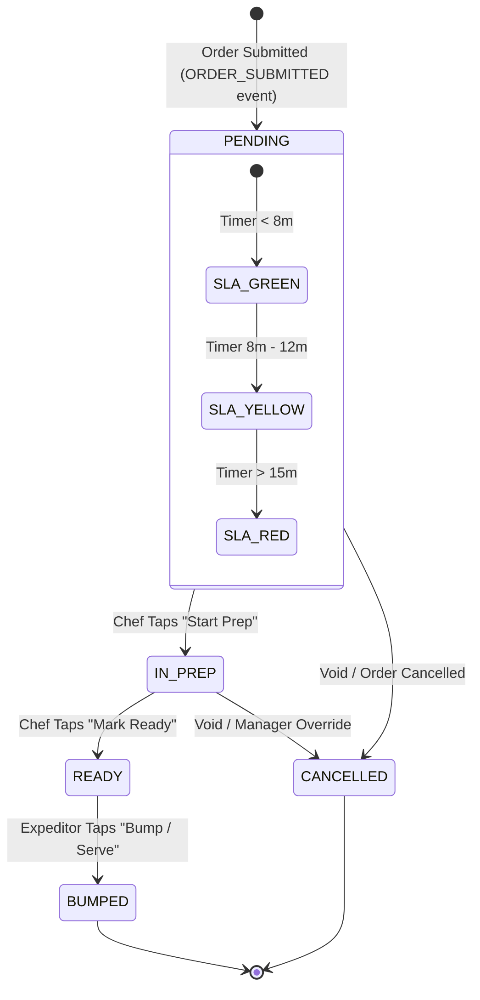

# 25-kds-kitchen-interaction.md - Kitchen Display Station Interaction Guide

**Author**: PlinthOS Documentation Team  
**Version**: 0.1.0  
**Last Reviewed**: 2026-08-28  
**Related Files**: 
- `22_order-taking-workflow.md` (order creation leads to KDS tickets)
- `23-payment-processing.md` (payment triggers KDS status updates)
- `24-split-bill-and-merging.md` (split/merge affects KDS tickets)
- `29-shift-management.md` (shift close and KDS reconciliation)
- `DEVELOPER-NAVIGATION.md` (for developers integrating KDS)

---

## 25.1 Ticket Lifecycle State Machine

PlinthOS uses a **deterministic state machine** for every KDS ticket. The states and transitions are enforced by the `KitchenTicket` aggregate root in `core-domain`.

### 25.1.1 State Diagram



### 25.1.2 State Definitions

| State | Meaning | Who Can Transition |
|---|---|---|
| **PENDING** | Order submitted, awaiting kitchen start | System (auto) or Chef |
| **IN_PREP** | Kitchen actively preparing item | Chef only |
| **READY** | Item completed, awaiting expeditor | Chef only |
| **BUMPED** | Item served/expedited to guest | Expeditor/Server only |
| **CANCELLED** | Item no longer needed | Chef or Manager |

### 25.1.2 SLA Timer Behavior

| State | Threshold | Visual on KDS |
|---|---|---|
| **SLA_GREEN** | < 8 minutes from PENDING | Green background |
| **SLA_YELLOW** | 8 - 12 minutes from PENDING | Yellow background + warning banner |
| **SLA_RED** | > 15 minutes from PENDING | Red background + manager alert + audible alert (if configured) |

**Timer reset**: Any status change (especially returning from CANCELLED to PENDING) resets the SLA timer.

---

## 25.2 Bump/Serve Workflow

### 25.2.1 What is a "Bump"?

A **bump** is the action of marking an item as served/collected by the guest. This is the final KDS state transition.

### 25.2.2 How to Bump

**From the KDS interface**:

1. **Locate the ticket** in the KDS queue (filter by station, course, SLA status)
2. **Find the specific ticket line** (item) to bump
3. **Tap the "Bump" button** (or swipe left → tap "Serve")
4. **System effects**:
   - Ticket line status → `BUMPED`
   - SLA timer **stops** (frozen at time of bump)
   - `TicketBumped` domain event emitted
   - Kitchen inventory updated (if item tracking)
   - Server KDS panel updates: item removed from active queue
   - POS reflects: check item marked as served

### 25.2.3 Bump Requirements

| Condition | Requirement |
|---|---|
| **Normal bump** | Any authorized staff member (Cashier, Server, Expeditor) |
| **Fast-track bump** | Requires `Permissions::FAST_TRACK` bitmask (bypasses IN_PREP → READY prerequisite) |
| **Cancelled bump** | Must have reason selected (e.g., "Customer changed order", "Wrong item") |

### 25.2.4 Fast-Track Bump

**Authorized roles** (configured per restaurant):

```rust
// Per core-domain enums::staff::Permissions
enum Permissions {
    TAKE_ORDER = 1 << 0,
    MANAGE_MENU = 1 << 1,
    VOID_ORDERS = 1 << 2,
    FAST_TRACK = 1 << 3,  // Allows BUMPED from any state
}
```

**When to fast-track**:
- Rush situations where standard workflow is too slow
- Customer requests (e.g., "I'm in a hurry")
- Pre-dessert or time-critical items

**Fast-track does NOT bypass**: SLA timer still runs (but may be hidden/adjusted in UI).

---

## 25.3 Course-Stage Tracking

### 25.3.1 Course Stages

Tickets are organized into **course stages** for kitchen workflow efficiency:

| Stage | Typical Items | KDS Visual |
|---|---|---|
| **APPETIZER** | Salads, soups, starters | Top row, green accent |
| **MAIN** | Entrees, burgers, pasta | Center row, default |
| **DESSERT** | Cakes, ice cream, coffee | Bottom row, purple accent |
| **DRINKS** | Beverages, sodas, cocktails | Side column, blue accent |

### 25.3.2 Setting Course Stage

**When creating/editing a ticket**:

1. **In the ticket editor**, tap "Course Stage"
2. **Select appropriate stage**:
   - Appetizer → items that should leave kitchen first
   - Main → core entrees
   - Dessert → after-main courses
   - Drinks → beverages (can start anytime)
3. **KDS auto-sorts** tickets by stage within each station
4. **Course progression** is tracked (cannot jump stages out of order unless fast-tracked)

### 25.3.3 Course Progression Rules

| Rule | Description |
|---|---|
| **Appetizer → Main** | Appetizer tickets should be BUMPED before Main tickets start (configurable) |
| **Main → Dessert** | Dessert tickets typically start after Main tickets are ~50% BUMPED |
| **Drinks** | Can start anytime; no dependency on other stages |
| **Override** | Manager can force stage change with auth |

---

## 25.4 Modifying Item Preparation Instructions

### 25.4.1 Adding/Editing Instructions

**Scenario**: Customer has special requests not covered by standard modifiers.

1. **In the KDS ticket view**, tap the specific line item
2. **Select "Edit Preparation"**
3. **Modify instructions**:
   - "No onions" (standard modifier)
   - "Well done" (standard modifier)
   - "Sauce on side" (custom note)
   - "Gluten free" (dietary requirement)
   - "Extra crispy" (custom)
4. **Tap "Save"**
5. **Updated instructions** print on next KOT and display on KDS

### 25.4.2 Allergen Notifications

**If item has allergen flags**:

1. **KDS automatically highlights** allergen items in red
2. **Banner displays**: "⚠ ALLERGEN NOTICE: Contains Peanuts / Dairy / Shellfish"
3. **Staff must acknowledge** before ticket can progress (checkbox: "Read & acknowledged")
4. **Violation**: Serving allergen without acknowledgment triggers manager alert

---

## 25.5 Station Assignment and Workload Balancing

### 25.5.1 Station Overview

Each restaurant has **KDS stations** configured in the dashboard:

| Station | Typical Items | Example Layout |
|---|---|---|
| **GRILL_01** | Burgers, steaks, chicken | Open grill station |
| **SALAD_01** | Salads, cold plates | Prep counter |
| **PASTA_01** | Pasta dishes, risotto | Burner station |
| **FRY_01** | Fried items, wings | Deep fryer station |
| **BAR** | Drinks, cocktails | Behind bar |

### 25.5.2 Automatic Station Balancing

When a ticket is created:

1. **System assigns** ticket to a station based on:
   - Item type (recipe mapping)
   - Current workload (items in flight per station)
   - Historical performance (per-station avg prep time)
2. **Station count** shown on KDS header (e.g., "Station 1 of 5")
3. **Station balance** visual: bars showing items per station

### 25.5.3 Manual Station Override

**Manager can reassign** a ticket to a different station:

1. **In KDS**, long-press the ticket
2. **Select "Change Station"**
3. **Choose different station** from list
4. **System moves** ticket and notifies that station's chef
5. **Original station** notified of removal

---

## 25.6 SLA Monitoring and Alerts

### 25.6.1 Visual SLA Indicators

| SLA State | KDS Visual | Manager Action |
|---|---|---|
| **Green** | Green background tick | None |
| **Yellow** | Yellow background + "⚠ 9m left" | Monitor; consider expediting |
| **Red** | Red background + "⚠ OVERDUE" + alarm | Manager intervention required; comp item possibly |

### 25.6.2 Audible Alerts

**Configurable per restaurant**:

| Setting | Behavior |
|---|---|
| **SLA alarm** | Beep sound when ticket hits SLA_RED |
| **Volume** | 0-100% (configurable per station) |
| **Auto-off** | Stops after 2 minutes, or when ticket leaves SLA_RED state |
| **Disable** | Turn off for quiet environments (fast-food, coffee shop) |

### 25.6.3 Manager Override

When a ticket is SLA_RED:

1. **Manager taps the ticket**
2. **Options**:
   - "Mark as Comp'd" (complimentary item given to customer)
   - "Fast-track to BUMPED" (bypasses remaining prep, if authorized)
   - "Extend SLA" (reset timer - requires justification)
   - "Escalate" (send alert to regional manager, if multi-location)

---

## 25.7 KDS-Offline Behavior

### 25.6.1 No Network Connection

If the network connection to the edge API is lost:

1. **KDS gracefully degrades**: continues showing active tickets from local SQLite cache
2. **New orders** still accepted by POS (local SQLite)
3. **Status changes** buffered locally and synced when network restores
4. **SLA timers** run locally (based on system time; may drift if no NTP)
5. **Conflict resolution**: when network restores, all local changes merged with server state (CRDT-based per sync-protocol)

### 25.6.2 Reconnecting

1. **Network restores**
2. **KDS auto-syncs**: pending status changes, new tickets, SLA updates
3. **Conflicts resolved** using vector clocks (per sync-protocol CRDT)
4. **SLA timers** adjusted if network downtime was significant
5. **Visual indicator**: "Syncing..." banner, then returns to normal

---

## 25.7 KDS Quick Reference

| Action | KDS UI Interaction | Effect |
|---|---|---|
| **Start Prep** | Tap "Start Prep" on PENDING ticket | Moves to IN_PREP; starts SLA timer |
| **Mark Ready** | Tap "Mark Ready" on IN_PREP ticket | Moves to READY; SLA timer stops (paused) |
| **Bump/Serve** | Tap "Bump" on READY ticket | Moves to BUMPED; SLA timer stops (frozen) |
| **Cancel** | Tap "Cancel" at any state (except BUMPED) | Moves to CANCELLED; SLA timer stops; emits event |
| **Fast-track** | Manager taps "Fast-track" (auth required) | Bypasses state prerequisites; still tracks SLA |
| **Change Station** | Long-press ticket → "Change Station" | Reassigns to different station |
| **Add Note** | Tap item → "Add Preparation Note" | Adds custom instructions to ticket |

### 25.7.2 Keyboard Shortcuts (if KDS is keyboard-operated)

| Shortcut | Action |
|---|---|
| **F2** | Start Prep on selected ticket |
| **F3** | Mark Ready |
| **F4** | Bump/Serve |
| **F5** | Cancel ticket |
| **F5** | Open station filter |
| **Arrow keys** | Navigate between tickets |
| **Enter** | Confirm selection |

---

## 25.8 Troubleshooting KDS Issues

| Issue | Cause | Resolution |
|---|---|---|
| "Stuck on PENDING" | Chef didn't tap "Start Prep"; network loss | Tap "Start Prep"; if offline, restore network |
| "Stuck on IN_PREP" | Chef completed but didn't tap "Mark Ready" | Tap "Mark Ready"; check kitchen communication |
| "SLA never turns green" | Timer misconfigured, or constant new items adding to ticket | Verify SLA thresholds in dashboard; check if ticket should be split |
| "Can't bump ticket" | Ticket not in READY state, or insufficient permissions | Ensure ticket is READY; check staff permissions |
| "Wrong station" | Ticket assigned to wrong station initially | Manager: long-press → "Change Station" |
| "KDS not showing new orders" | Edge API/WebSocket disconnected | Restart KDS client; check network; view local queue |
| "Allergen banner not showing" | Item not flagged as allergen in recipe | Update recipe in dashboard; re-sync KDS |
| "SLA alarm too loud" | Config too loud for environment | Manager: reduce volume in KDS settings |

---

## 25.9 Next Steps

After mastering KDS interaction:

1. **Read** `29-shift-management.md` for shift close and KDS reconciliation
2. **Read** `24-split-bill-and-merging.md` for split/merge KDS impact
3. **Read** `33-troubleshooting-guide.md` for comprehensive issue resolution
4. **If you're a developer**: Read the KDS aggregate in `packages/core-domain/src/models/kitchen.rs` and the WebSocket handlers in `apps/edge-api/src/routes/kds.rs`

---
*This file is part of the PlinthOS end user documentation set.*